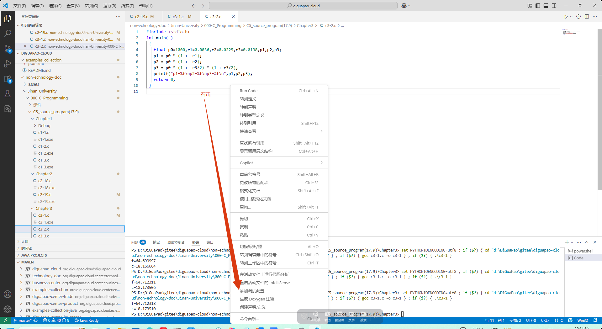
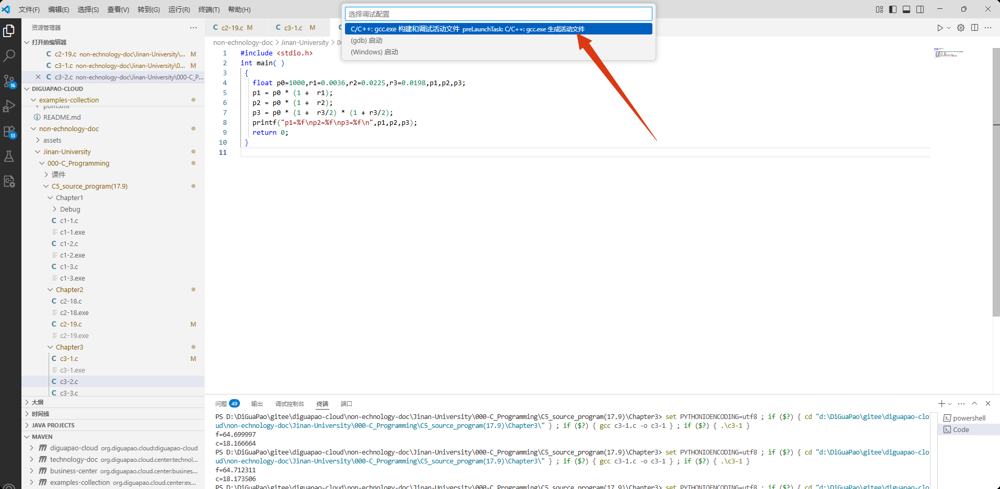

# 说明

一、 提供的是《C程序设计（第五版）》中各章的全部例题的源程序，按章对应。文件名c1-1.c表示是教材中第1章例1.1的源程序。如果在一个例题中出现一个以上程序，则以c5-8-2.c形式表示，它是第5章例5.8中的第2个源程序。

二、 在使用这些程序时，请结合参阅《C程序设计（第五版）》中对应的例题中的有关说明。

三、 这些源程序可以直接上机进行编译和运行。

# 环境配置

参见：

https://zhuanlan.zhihu.com/p/26143367916

https://zhuanlan.zhihu.com/p/1921587106700071006

# 添加调试属性





这时会生成 .vscode\launch.json，调整为如下配置即可

```json
{
  "configurations": [
    {
      "name": "C/C++: gcc.exe 构建和调试活动文件",
      "type": "cppdbg",
      "request": "launch",
      "program": "${fileDirname}\\${fileBasenameNoExtension}.exe",
      "args": [],
      "stopAtEntry": false,
      "cwd": "${fileDirname}",
      "environment": [
        {
          "name": "LANG",
          "value": "zh_CN.UTF-8"
        },
        {
          "name": "LC_ALL",
          "value": "zh_CN.UTF-8"
        }
      ],
      "externalConsole": false,
      "MIMode": "gdb",
      "miDebuggerPath": "D:\\soft\\windows\\mingw64\\bin\\gdb.exe",
      "setupCommands": [
        {
          "description": "为 gdb 启用整齐打印",
          "text": "-enable-pretty-printing",
          "ignoreFailures": true
        },
        {
          "description": "将反汇编风格设置为 Intel",
          "text": "-gdb-set disassembly-flavor intel",
          "ignoreFailures": true
        }
      ],
      "preLaunchTask": "C/C++: gcc.exe 生成活动文件"
    }
  ],
  "version": "2.0.0"
}
```

# vs code .c 文件执行run code，中断报错时中文乱码

参见：https://blog.csdn.net/2301_80165396/article/details/147083267

