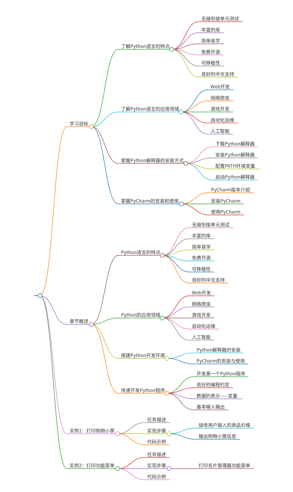
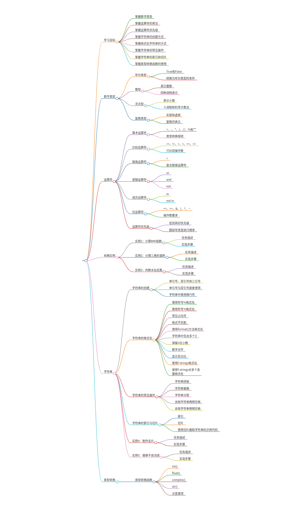
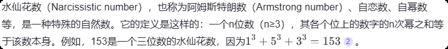

# Python程序开发案例教程（第2版）


# 第1章

## 脑图




详细介绍了Python语言的基础知识，包括其特点、应用领域、开发环境的搭建、编程约定、变量、基本输入输出等内容。以下是文章的主要内容：

## Python概述

### 1. Python的特点

- **无缝衔接单元测试**：Python内置了许多标准库，还支持开发人员贡献的丰富的第三方库或框架，覆盖了几乎所有领域的开发需求。
- **丰富的库**：Python拥有大量的库，如Pandas、Matplotlib等，可以帮助用户快速实现数据分析和可视化的功能；Flask和Django等框架，可以帮助用户简化开发程序的流程。
- **简单易学**：Python的语法规则十分简洁，使用它编写的代码非常接近自然语言，用户只需要具备英语基础，就能够大致读懂代码。
- **免费开源**：Python是开源的，用户可以自由复制、阅读、改动源码，提高其灵活性和可扩展性。
- **可移植性**：Python是一种解释型语言，可以在任何安装Python解释器的环境中执行，具有良好的可移植性。
- **良好的中文支持**：Python支持Unicode编码，可以轻松地编写、读取、处理中文字符，并与其他语言的字符进行无缝交互。

### 2. Python的应用领域

- **Web开发**：Python是Web开发的主流语言之一，类库丰富、使用方便，具有强大的数据处理能力。
- **网络爬虫**：Python自带的urllib库、第三方库requests、Scrapy框架、pysider框架等让网络爬虫变得非常简单。
- **游戏开发**：Python标准库提供了pygame模块，用户使用该模块可以制作2D游戏。
- **自动化运维**：Python编写的系统管理脚本在可读性、性能、代码重用度、扩展性这几方面都优于Shell脚本。
- **人工智能**：Python是人工智能领域的主流编程语言，神经网络框架PyTorch就采用了Python语言。

## 搭建Python开发环境

### 1. Python解释器的安装

- **下载Python解释器**：在浏览器中访问Python解释器的下载页面，选择相应版本的安装包进行下载。
- **安装Python解释器**：下载完成后，双击安装包进行安装，勾选“Add python.exe to PATH”选项后，单击Install Now按钮进行安装。
- **验证安装**：安装完成后，在计算机的开始菜单中搜索Python，找到并单击Python 3.11（64-bit）打开Python解释器窗口。

### 2. PyCharm的安装与使用

- **PyCharm的安装**：在浏览器中访问PyCharm官网的下载页面，选择Community或Professional版本进行下载和安装。
- **PyCharm的使用**：双击桌面上的PyCharm快捷方式图标，打开Welcome to PyCharm窗口，进行自定义配置和项目创建。
- **编写和运行代码**：在项目中创建Python文件，编写代码后，单击窗口上方的运行按钮或使用快捷键“Shift+F10”运行代码。

## 快速开发Python程序

### 1. 开发第一个Python程序

- **实现步骤**：接收用户输入的手机号码与充值金额，保存用户输入的手机号码与充值金额，提示用户充值成功。
- **编写代码**：使用input()函数接收用户输入，使用print()函数输出充值成功的信息。
- **运行程序**：在命令行中输入要充值的手机号码和金额，查看输出结果。

### 2. 良好的编程约定

- **代码布局**：遵循标准的Python风格，使用4个空格进行缩进，每行最大长度不超过79个字符，适当使用空白行和分隔符。
- **代码注释**：使用块注释、行内注释和文档字符串进行代码解释和说明。
- **命名规范**：模块名、包名简短且全为小写字母，函数名全为小写字母，类名首字母大写，常量名全为大写字母。

### 3. 数据的表示——变量

- **变量定义**：Python中定义变量的方式非常简单，只需要指定数据和变量名即可。
- **变量命名规则**：变量名由字母、数字和下画线组成，不以数字开头，区分大小写，不允许使用关键字。

### 4. 基本输入输出

- **input()函数**：用于接收用户从键盘输入的数据，返回一个字符串类型数据。
- **print()函数**：用于向控制台中输出数据，可以输出任何类型的数据，支持多个数据的分隔和自定义结束符。

## 实例1：打印购物小票

### 1. 任务描述

- **购物小票的作用**：购物小票是用户购物经历的消费凭证，包含商品名称、数量、单价及总金额等信息。

### 2. 实现步骤

- **接收用户输入**：依次接收用户输入的商品价格。
- **输出购物小票信息**：根据输入的商品价格，输出购物小票的信息。

## 实例2：打印功能菜单

### 1. 任务描述

- **功能菜单的作用**：功能菜单为用户提供功能菜单列表，方便用户浏览和选择相应的功能。

### 2. 实现步骤

- **编写代码**：实现打印名片管理器功能菜单的功能。

## 关键问题及回答

**问题1：在搭建Python开发环境时，如何选择合适的Python解释器版本？**

**回答**：在选择Python解释器版本时，应考虑以下因素：

1. **系统兼容性**：确保选择的Python版本与你的操作系统（如Windows、macOS、Linux）兼容。
2. **用途**：根据你的具体需求选择版本。例如，如果你需要开发Web应用，可以选择支持Django或Flask的版本；如果你需要进行数据分析，可以选择包含Pandas和NumPy的版本。
3. **社区支持**：选择社区活跃、更新频繁的版本，以便获得更好的支持和资源。
4. **未来发展**：考虑Python的长期发展规划，选择一个持续更新的版本以确保未来的兼容性。

**问题2：在编写Python程序时，如何遵循良好的编程约定以提高代码的可读性和可维护性？**

**回答**：遵循良好的编程约定可以提高代码的可读性和可维护性，具体包括以下几点：

1. **缩进**：使用4个空格进行缩进，避免使用Tab键，禁止混用空格与Tab。
2. **行的最大长度**：每行代码长度不应超过79个字符，以减少换行带来的不便。
3. **空白行**：顶层函数和类之间空两行，类中的每个方法之间空一行；函数内逻辑无关的代码段之间空一行，其他位置尽量不要空行。
4. **代码注释**：使用块注释、行内注释和文档字符串进行注释，解释代码的功能和逻辑。
5. **命名规范**：模块名、包名简短且全为小写字母，函数名全为小写字母，类名首字母大写，常量名全为大写字母。

**问题3：在Python中如何处理和操作中文字符？**

**回答**：Python内置了对Unicode编码的支持，可以轻松处理和操作中文字符。具体方法包括：

1. **编码支持**：确保文件以UTF-8编码保存，这样Python可以正确识别和处理中文字符。
2. **输入输出**：使用`input()`函数接收用户输入时，默认情况下会处理中文字符。使用`print()`函数输出中文字符时，也会自动处理编码问题。
3. **第三方库**：Python社区提供了多种针对中文文本处理的库，如`jieba`库用于中文分词，`中文自然语言处理库`用于更复杂的中文处理任务。
4. **Unicode字符串**：在代码中使用Unicode字符串（即在字符串前加`u`前缀），例如`u'你好'`。

## 关联信息补充

## 人物

暂无相关人物信息；

## 组织机构：

**JetBrains**（JetBrains公司）：一家专注于开发智能软件开发工具的软件公司，总部位于捷克。其开发的PyCharm是Python主流集成开发环境（IDE），以智能代码补全、调试和项目管理功能著称，被广泛用于Python开发。

**Python社区**（Python社区）：由全球Python开发者组成的开放协作组织，维护Python语言发展、文档编写及第三方库（如Pandas、PyTorch）的贡献。社区活跃度高，提供大量教程和资源，推动Python在数据科学、AI等领域的应用。


# 第2章

## 脑图




## 研究背景

1. **研究问题**：本文主要研究了如何在Python程序中正确表示和处理不同类型的数字数据和文本数据。具体来说，涵盖了数字类型的表示、运算符的使用、字符串的创建和操作、以及类型转换函数的应用。
2. **研究难点**：该问题的研究难点包括：如何准确地创建和操作不同类型的数字和文本数据，如何在数值运算中正确使用运算符，以及如何高效地格式化字符串。
3. **相关工作**：本文的相关工作包括对Python基本数据类型和运算符的详细介绍，通过对实例的分析和讲解，帮助读者熟练掌握这些基础知识。

## 研究方法

这篇论文提出了通过理论讲解和实例演示的方法，系统地介绍了Python中数字类型和字符串类型的操作。具体来说，

1. **数字类型**：首先，论文详细介绍了Python中的数字类型，包括整型（int）、浮点型（float）、复数类型（complex）和布尔类型（bool）。每种类型都有其特定的表示方式和应用场景。
2. **运算符**：其次，论文讲解了Python中的各类运算符，包括算术运算符（+、-、\*、/、//、%、\*\*）、比较运算符（==、!=、>、<、>=、<=）、赋值运算符（+=、-=、*=、/=、//=、%=、\*\***=）、逻辑运算符（or、and、not）和成员运算符（in、not in）。每种运算符的功能和使用场景都有详细的说明。


`//` 运算符称为**整除**或**地板除**（Floor Division）。它执行除法操作，但结果是被除数除以除数得到的商的整数部分，向下取整到最接近的整数。如果结果为正数，则会舍去小数部分；如果是负数，则会向更小的数取整。

示例：

```python
print(7 // 2)  # 输出: 3
print(-7 // 2) # 输出: -4 （注意：对于负数，结果会向负无穷方向取整）
```


`%` 运算符称为**取模**或**求余**（Modulo）。它返回的是两数相除后的余数。这个运算符对于确定一个数是否能被另一个数整除非常有用，例如判断奇偶性等。

 示例：

```python
print(7 % 2)  # 输出: 1
print(8 % 2)  # 输出: 0
```


** 是幂运算符（exponentiation operator），它用于计算一个数的幂。换句话说，x ** y 表达式会计算 x 的 y 次方。例如：

```python
result = 2 ** 3  # 这将计算2的3次方，即2 * 2 * 2 = 8
print(result)  # 输出：8
```

在这个例子中，2 ** 3 计算的是 2 的 3 次幂，结果是 8。

此外，** 运算符也可以用来进行开方运算。例如，要计算一个数的平方根，可以使用该数的 0.5 次幂：

```python
import math

number = 16
square_root = number ** 0.5  # 计算16的平方根，即16的0.5次方
print(square_root)  # 输出：4.0
```

同样地，你可以计算立方根或任何其他根：

```python
cube_root = 8 ** (1/3)  # 计算8的立方根，即8的1/3次方
print(cube_root)  # 输出：2.0
```

需要注意的是，当使用 ** 进行幂运算时，如果底数是负数且指数不是整数，则结果将会是一个复数。例如：

```python
negative_power = (-1) ** 0.5  # 计算-1的平方根
print(negative_power)  # 输出：(6.123233995736766e-17+1j)，这是一个复数近似于0+1j
```

这里的结果是一个复数，因为在实数范围内无法得到负数的平方根。在Python中，虚数单位通常用 j 来表示。上面的例子中，由于浮点数精度问题，实部并不是精确的 0，但可以认为是数学上的 0。

另外，在函数参数传递时，** 也有特殊的含义，用于解包字典为关键字参数，但这与幂运算无关。


`**=` 是一个复合赋值运算符（compound assignment operator），它结合了幂运算（exponentiation）和赋值操作。具体来说，`x **= y` 这个表达式意味着将 `x` 的值设置为其原值的 `y` 次幂的结果，并将这个结果赋值回给 `x`。这相当于执行了 `x = x ** y` 的操作。

例如：

```python
x = 2
x **= 3  	# 等价于 x = x ** 3
print(x)  	# 输出: 8
```

在这个例子中，`x` 原始值为 2，通过 `x **= 3` 操作后，`x` 变成了 2 的 3 次方，即 8。

这种类型的运算符是方便快捷地进行变量更新的一种方式，避免了重复书写变量名，并且可以使代码更加简洁易读。除了 `**=` 之外，Python 还支持其他多种复合赋值运算符，如 `+=`, `-=`, `*=`, `/=`, `//=`, 和 `%=` 等，它们分别对应加法、减法、乘法、普通除法、整数除法和取模运算的复合赋值操作。这些运算符提高了编程效率，减少了出错的可能性。


3. **字符串操作**：此外，论文还介绍了字符串的创建方式、格式化方法、常见操作（拼接、替换、分割、去除两侧空格）以及索引和切片的使用。通过实例演示，读者可以掌握这些操作的具体实现方法。
4. **类型转换**：最后，论文讲解了如何使用类型转换函数（int()、float()、complex()、str()）在不同类型的数据之间进行转换，并指出了在使用这些函数时需要注意的事项。

## 实验设计

本文通过多个实例来展示和验证所讲内容：

1. **计算BMI指数**：接收用户输入的体重和身高数据，按照BMI公式计算BMI值。

2. **计算三角形面积**：接收用户输入的三角形三条边长，计算三角形的半周长和面积。

3. **判断水仙花数**：接收用户输入的三位数字，判断其是否为水仙花数。

   什么是水仙花数？

   

   一个通用的Python函数实现来判断一个数是否为水仙花数：

   ```python
   def is_narcissistic(num):
       # 将数字转换为字符串，方便逐位处理
       num_str = str(num)
       # 获取数字的位数
       n = len(num_str)
       # 计算各位数字的n次幂之和
       sum_of_powers = sum(int(digit) ** n for digit in num_str)
       # 判断是否等于原数
       return sum_of_powers == num
   
   # 测试
   number = 153  # 可以替换为你想测试的任何整数
   if is_narcissistic(number):
       print(f"{number} 是水仙花数")
   else:
       print(f"{number} 不是水仙花数")
   ```

   判断一个数是否为水仙花数Java 版：

   ```java
   public static boolean isNarcissistic(int num) {
       // 将数字转换为字符串，方便逐位处理
       String numStr = Integer.toString(num);
       // 获取数字的位数
       int n = numStr.length();
       // 计算各位数字的n次幂之和
       int sumOfPowers = 0;
       for (int i = 0; i < numStr.length(); i++) {
           // 取出每一位数字并计算其n次幂
           int digit = Character.getNumericValue(numStr.charAt(i));
           sumOfPowers += Math.pow(digit, n);
       }
       // 判断是否等于原数
       return sumOfPowers == num;
   }
   ```

   

   

    找出 Long.max() 范围内的所有水仙花数：

   ```python
   def find_narcissistic_numbers(max_value):
       # 遍历可能的位数，从3开始直到找到的最大水仙花数的位数为止
       for digits in range(3, 39 + 1):  # 假设我们知道的最大水仙花数是39位
           lower_bound = 10 ** (digits - 1)
           upper_bound = min(10 ** digits - 1, max_value)
   
           if lower_bound > max_value:
               break
   
           # 预先计算0-9的digits次幂
           power_table = {str(i): i**digits for i in range(10)}
   
           for num in range(lower_bound, upper_bound + 1):
               sum_of_powers = sum(power_table[digit] for digit in str(num))
               if sum_of_powers == num:
                   print(num)
   
   # 设置最大值为long.max对应的值，在Python中可以用sys.maxsize来近似表示
   import sys
   find_narcissistic_numbers(sys.maxsize)
   ```

   

   

4. **制作名片**：接收用户输入的个人信息，按照名片格式进行格式化输出。

5. **替换不良词语**：遍历包含不良词语的字符串，将其替换为指定的词语。

6. **模拟超市收银抹零行为**：计算用户商品总金额，使用int()函数实现抹零行为。

## 结果与分析

1. **计算BMI指数**：通过实例验证了BMI指数的计算公式和方法的正确性。
2. **计算三角形面积**：通过实例验证了海伦公式的应用，成功计算出三角形的面积。
3. **判断水仙花数**：通过实例验证了判断水仙花数的逻辑和方法的正确性。
4. **制作名片**：通过实例展示了名片格式的化输出效果。
5. **替换不良词语**：通过实例验证了文本中不良词语的替换效果。
6. **模拟超市收银抹零行为**：通过实例验证了抹零行为的实现方法和效果。

## 总体结论

本文系统地介绍了Python中数字类型和字符串类型的操作，通过多个实例展示了这些知识点的实际应用。通过学习本章内容，读者能够熟练掌握Python中数字类型和字符串类型的常见操作，为后续的深入学习打下坚实的基础。

## 论文评价

## 优点与创新

1. **全面覆盖**：本书详细介绍了Python中的数字类型、字符串类型、运算符、数据类型转换等内容，内容全面且系统。
2. **实例丰富**：通过多个实例（如计算BMI指数、计算三角形面积、判断水仙花数、制作名片、替换不良词语、模拟超市收银抹零行为）展示了各种概念和应用场景，增强了学习的直观性和实用性。
3. **操作性强**：书中不仅介绍了各种数据类型和运算符的基本用法，还详细讲解了如何进行字符串格式化、常见操作、索引与切片等，具有很强的操作性。
4. **格式化方法多样**：详细介绍了使用%、format()和f-string三种方式进行字符串格式化的方法，满足不同场景下的需求。
5. **类型转换函数**：讲解了数字类型和字符串之间的转换函数（如int()、float()、complex()、str()），并提醒了使用时的注意事项，非常实用。
6. **运算符优先级**：明确了Python中各种运算符的优先级，并解释了如何使用圆括号改变表达式的执行顺序，有助于避免运算歧义。

## 不足与反思

1. **局限性**：本书主要集中在基础知识的讲解上，对于高级特性和应用场景涉及较少，可能不适合有一定Python基础的读者。
2. **下一步工作**：书中未明确提到下一步工作，但从内容来看，未来可以考虑增加更多实际项目案例，进一步加深读者对Python应用的理解和掌握。

## 关键问题及回答

**问题1：Python中的布尔类型有哪些特殊用法？**

在Python中，布尔类型（bool）主要用于表示逻辑值，它只有两个可能的取值：True和False。布尔类型可以进行多种操作，例如与其他数据类型进行比较和逻辑运算。此外，Python中任何类型的数据都具有布尔属性，它们可以根据一定的规则转换为布尔类型的值。例如，以下类型的数据会被转换为False：

- None
- 任何为0的数字类型，如0、0.0、0j
- 空字符串，如''、''''
- 任何为空的复杂类型，如空元组()、空列表[]、空字典{}

这些特性使得布尔类型在条件判断和逻辑运算中非常有用。

**问题2：Python中的字符串格式化有哪些常用方法？各方法的优缺点是什么？**

Python中常用的字符串格式化方法包括以下几种：

1. **使用符号%格式化**：这是最传统的字符串格式化方法，通过在字符串中使用%符号和对应的格式说明符来插入变量或表达式。优点是简单直观，缺点是需要记住各种格式说明符，并且格式化字符串时需要注意变量的类型。
2. **使用format()方法格式化**：format()方法提供了一种更灵活和强大的字符串格式化方式。它允许在字符串中使用{}作为占位符，并通过传递一个包含实际数据的元组来进行格式化。优点是可以处理任意类型的变量，并且可以指定填充值的顺序和格式。缺点是语法相对复杂一些。
3. **使用f-strings格式化**：f-strings是Python 3.6及以上版本引入的一种简洁且高效的字符串格式化方法。它通过在字符串前加上f或F，并使用{}来标明被替换的变量位置。f-strings在运行时进行运算求值，因此效率优于%和format()方法。优点是简洁易读，缺点是只能在Python 3.6及以上版本中使用。

**问题3：Python中的位运算符有哪些？它们各自的功能是什么？**

Python中的位运算符包括以下几种：

1. **<<**：左移运算符，将一个数的二进制表示向左移动指定的位数，右边空出的位用0填充。
2. **>>**：右移运算符，将一个数的二进制表示向右移动指定的位数，左边空出的位用符号位填充。
3. **&**：按位与运算符，对应位都为1时结果为1，否则为0。
4. **|**：按位或运算符，对应位有一个为1时结果为1，否则为0。
5. **^**：按位异或运算符，对应位不同时结果为1，否则为0。
6. **~**：按位取反运算符，对一个数的二进制表示进行取反操作，即1变为0，0变为1。

这些位运算符主要用于对整数在二进制位上进行操作，可以实现多种位运算功能，如位移、掩码、异或等。