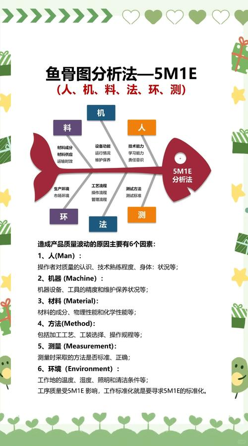

*注：内容由AI生成。*

# 关于和结构化思维相悖的七大错误

以下是“和结构化思维相悖的七大错误”的详细解析，每一个错误都从定义、表现、影响以及如何避免等角度进行深入分析，帮助你更好地理解这些常见思维误区，并提升结构化思维能力。

---

## **七大错误之一：审题错误**

### ✅ 定义：
**审题错误**指的是在面对问题或任务时，没有准确理解问题的核心要求、背景条件或限制因素，导致后续思考方向偏离实际需求。

### 📌 表现形式：
- 忽略题目关键词或限定条件。
- 把复杂问题简单化，或者把简单问题复杂化。
- 没有抓住问题的本质，答非所问。
- 过早进入解决方案阶段，而没有对问题本身进行充分分析。

### ⚠️ 影响：
- 导致整个分析过程建立在错误的理解基础上。
- 资源浪费（时间、人力、资金）。
- 无法真正解决问题，甚至制造新问题。

### ✅ 如何避免：
- 使用“5W1H”法（What, Why, Who, Where, When, How）明确问题边界。
- 反复确认问题描述，必要时与提问者沟通澄清。
- 将问题拆解为若干子问题，逐一确认是否理解正确。

---

## **七大错误之二：我执错误**

### ✅ 定义：
**我执错误**是指个体在思考过程中过于坚持自己的观点、经验或偏好，忽视客观事实、他人意见或数据支持，陷入主观主义。

### 📌 表现形式：
- 对不同意见采取排斥态度。
- 认为自己经验丰富就无需听取他人建议。
- 在缺乏数据支持的情况下做出决策。
- 不愿承认错误或调整思路。

### ⚠️ 影响：
- 团队协作受阻，信息闭塞。
- 决策质量下降，容易产生偏见。
- 阻碍创新和学习成长。

### ✅ 如何避免：
- 培养“空杯心态”，保持开放。
- 多方收集信息，用数据说话。
- 主动倾听他人意见，尤其是反面意见。
- 设立“红队机制”模拟反对立场，验证逻辑漏洞。

---

## **七大错误之三：金字塔错误**

### ✅ 定义：
**金字塔错误**是指在表达或组织信息时未能按照“自上而下、先总后分”的逻辑结构展开，导致信息混乱、重点不突出、支撑不清晰。

### 📌 表现形式：
- 开头没有核心结论，直接罗列细节。
- 缺乏中心思想或主线逻辑。
- 支撑点之间逻辑不清，重复或无关。
- 层级混乱，信息跳跃，读者难以跟上节奏。

### ⚠️ 影响：
- 交流效率低下，听众/读者难以理解。
- 报告、方案、汇报内容缺乏说服力。
- 思维混乱，影响团队协同。

### ✅ 如何避免：
- 使用“金字塔原理”结构：结论先行 → 分层论述 → 逻辑归类 → 顺序排列。
- 每个段落只表达一个中心思想。
- 用MECE原则（Mutually Exclusive, Collectively Exhaustive）分类信息。
- 先讲结论，再讲理由；先讲整体，再讲细节。

---

## **七大错误之四：人力错误**

### ✅ 定义：
**人力错误**是指在执行任务或项目时，没有合理配置人力资源，导致人岗不匹配、分工不合理、资源浪费或效率低下。

### 📌 表现形式：
- 将不擅长某项工作的人员安排到该岗位。
- 工作量分配不均，有人忙死，有人闲着。
- 没有根据成员的能力、兴趣、经验来优化分工。
- 忽视跨部门协作或外部资源整合。

### ⚠️ 影响：
- 项目进度延迟，质量下降。
- 团队士气低落，内部矛盾增加。
- 成本上升，效率降低。

### ✅ 如何避免：
- 明确每个人的角色、职责与目标。
- 使用RACI矩阵（Responsible, Accountable, Consulted, Informed）进行责任划分。
- 根据项目需要灵活调配人力资源。
- 定期评估团队绩效，及时调整分工。

---

## **七大错误之五：分析错误**

### ✅ 定义：
**分析错误**是指在处理问题时缺乏系统性、逻辑性和工具支持，导致分析深度不足、方向偏差或结论不可靠。

### 📌 表现形式：
- 没有使用专业工具（如SWOT、PEST、5Why、鱼骨图、帕累托图等）辅助分析。
- 数据收集不全面或不真实。
- 分析过程跳跃，缺乏中间推导步骤。
- 混淆因果关系与相关关系。

### ⚠️ 影响：
- 分析结果失真，误导决策。
- 解决方案无效或治标不治本。
- 时间成本高但产出有限。

### ✅ 如何避免：
- 掌握并熟练运用常见的分析工具和方法。
- 强调“结构化分析”而非直觉判断。
- 用数据驱动决策，减少主观臆断。
- 建立分析流程标准，确保每一步都有依据可查。

---

## **七大错误之六：行动错误**

### ✅ 定义：
**行动错误**是指在制定计划或执行策略时，缺乏可行性、可操作性或执行力，导致计划落空、执行脱节。

### 📌 表现形式：
- 目标设定过高或过模糊，无法落地。
- 缺乏具体行动计划和时间节点。
- 没有考虑资源限制、风险控制和应急预案。
- 执行过程中缺乏反馈机制和调整空间。

### ⚠️ 影响：
- 计划成为空谈，执行流于形式。
- 项目推进缓慢或失败。
- 团队信心受挫，管理层失去信任。

### ✅ 如何避免：
- 使用SMART原则设定目标（Specific, Measurable, Achievable, Relevant, Time-bound）。
- 制定详细的实施路径图（Gantt图、甘特图、PDCA循环）。
- 设置关键里程碑和阶段性成果。
- 建立反馈机制，定期评估进展并动态调整。

---

## **七大错误之七：静止错误**

### ✅ 定义：
**静止错误**是指在思考和执行过程中，忽视变化和动态发展，将问题视为静态不变的，从而导致应对迟缓、错失良机。

### 📌 表现形式：
- 忽视市场、环境、政策的变化趋势。
- 拒绝适应新的技术、流程或管理方式。
- 缺乏前瞻性思维，应对突发事件能力差。
- 依赖过去的经验解决当前的问题。

### ⚠️ 影响：
- 错误判断形势，导致战略失误。
- 企业或个人竞争力下降。
- 风险应对能力弱，抗压能力差。

### ✅ 如何避免：
- 建立“动态思维”，关注变化和趋势。
- 定期进行环境扫描（如PESTEL分析）。
- 鼓励创新思维，鼓励试错和迭代。
- 建立预警机制和应急响应体系。

---

## ✅ 总结表格

| 错误编号 | 错误名称   | 简要解释                   | 核心问题 | 应对策略                       |
| -------- | ---------- | -------------------------- | -------- | ------------------------------ |
| 一       | 审题错误   | 没有准确理解问题本质       | 理解偏差 | 用5W1H法确认问题               |
| 二       | 我执错误   | 过度坚持己见，忽视客观事实 | 主观偏见 | 保持开放，多方求证             |
| 三       | 金字塔错误 | 信息组织混乱，缺乏逻辑结构 | 表达无序 | 使用金字塔原理组织信息         |
| 四       | 人力错误   | 人员配置不当，分工不合理   | 资源错配 | RACI矩阵+动态调整              |
| 五       | 分析错误   | 缺乏系统性分析工具与方法   | 分析肤浅 | 学会常用分析模型，强调数据驱动 |
| 六       | 行动错误   | 计划不可行，执行不到位     | 执行脱节 | SMART目标+PDCA+反馈机制        |
| 七       | 静止错误   | 忽视变化，缺乏动态思维     | 思维僵化 | 动态监控+趋势预判+快速反应     |

# 七大错误打深一层

当然可以！在上一次回答中，我们系统梳理了“与结构化思维相悖的七大错误”，包括它们的定义、表现、影响以及应对策略。为了帮助你更深入理解和掌握这些内容，下面我将在原有基础上进行**扩展详述**，分别从以下维度进一步展开：

---

## 🧠 一、审题错误 —— 思维起点的偏差

### 🔍 深度解析：
审题是结构化思维的第一步，也是最基础的一环。很多人之所以在后续分析中出现逻辑混乱、方向偏移，根源就在于没有准确把握问题的核心。

### 📌 典型案例：
- **面试场景**：HR问：“你如何处理团队中的冲突？”求职者却大谈自己如何独当一面、不依赖他人。
- **职场汇报**：领导问：“这个项目为什么延期？”员工却开始讲市场环境不好、客户刁难等外部原因。

### 🛠️ 训练方法：
- 练习“问题重述”技巧：听完问题后，用自己的话复述一遍，确认理解无误。
- 使用“问题拆解表”：将问题拆成Who/What/Why/How四个维度，逐项分析。
- 设置“反向提问机制”：在答题前先问几个澄清性的问题，确保精准理解。

---

## 🧠 二、我执错误 —— 自我中心的陷阱

### 🔍 深度解析：
我执是一种认知偏差，表现为对自我经验或观点的过度依赖，忽视客观事实和多元视角。它常常导致判断失误、决策失衡。

### 📌 典型案例：
- 团队讨论时，某成员坚持使用自己熟悉的工具，即使有更好的替代方案也拒绝尝试。
- 高层管理者凭经验否决新业务建议，理由是“以前试过不行”。

### 🛠️ 训练方法：
- 引入“红蓝对抗法”：主动扮演反对派角色，挑战自己的观点。
- 实施“意见盲盒练习”：匿名提交观点后再评估，避免受身份干扰。
- 学会“假设检验式思考”：提出一个观点后，列出可能反驳它的证据。

---

## 🧠 三、金字塔错误 —— 表达逻辑的混乱

### 🔍 深度解析：
金字塔原理强调“结论先行、层次分明、归类分组、逻辑排序”。金字塔错误的本质是表达结构不合理，信息传递效率低。

### 📌 典型案例：
- 写报告时先写过程再写结果，读者看完仍不知道核心结论是什么。
- 做PPT时一页放七八个要点，毫无重点可言。

### 🛠️ 训练方法：
- 练习“一句话总结”：每段文字都试着用一句话概括核心思想。
- 使用“倒金字塔写作法”：先写结论 → 支撑点 → 举例说明。
- 制作“金字塔结构图”：用图形工具画出你的表达结构，检查是否清晰。

---

## 🧠 四、人力错误 —— 资源配置的失误

### 🔍 深度解析：
人力错误不仅仅是“用人不当”，更是缺乏系统性的人力资源管理思维。它可能导致项目失败、团队内耗甚至组织动荡。

### 📌 典型案例：
- 把擅长数据分析的人员安排去做文案工作。
- 在跨部门协作中，未明确责任边界，导致推诿扯皮。

### 🛠️ 训练方法：
- 掌握RACI矩阵（Responsible, Accountable, Consulted, Informed）来分配任务。
- 建立“人才画像库”：记录团队成员的能力、性格、偏好等信息。
- 进行“岗位匹配模拟演练”：根据项目需求快速筛选合适人选。

---

## 🧠 五、分析错误 —— 缺乏科学的推理路径

### 🔍 深度解析：
分析错误是结构化思维中最常见的问题之一。它体现为思考方式不系统、工具运用不熟练、数据支撑不足。

### 📌 典型案例：
- 分析销售下滑原因时只说“市场不好”，而没有细分渠道、产品、客户等维度。
- 用主观感受代替数据分析做预算调整。

### 🛠️ 训练方法：
- 熟练掌握常用分析模型：如SWOT、PEST、5Why、鱼骨图、帕累托法则等。
- 实践“数据驱动决策”：每次分析尽量引用具体数据支持结论。
- 开展“因果链训练”：从现象出发，层层追问“为什么会这样”。

---

## 🧠 六、行动错误 —— 执行层面的脱节

### 🔍 深度解析：
结构化思维不仅关注“想清楚”，还要“干明白”。行动错误是指计划制定不合理、执行不到位、反馈机制缺失。

### 📌 典型案例：
- 制定项目计划时没有考虑时间缓冲期，导致进度严重滞后。
- 任务布置模糊，成员不清楚要完成什么、什么时候完成。

### 🛠️ 训练方法：
- 使用SMART原则设定目标。
- 绘制Gantt图或甘特图，可视化项目进度。
- 建立PDCA循环（Plan-Do-Check-Act），持续优化执行过程。
- 设置KPI或OKR，量化成果并追踪进展。

---

## 🧠 七、静止错误 —— 忽视变化的僵化思维

### 🔍 深度解析：
世界是动态的，但很多人习惯于静态地看待问题，导致错失良机、应对迟缓。

### 📌 典型案例：
- 企业还在沿用十年前的营销策略，面对新兴平台反应迟钝。
- 个人职业规划多年不变，无法适应行业趋势。

### 🛠️ 训练方法：
- 定期进行PESTEL分析（政治、经济、社会、技术、环境、法律）。
- 建立“趋势跟踪机制”：关注行业报告、政策动向、技术创新。
- 设计“应急响应预案”：预设可能的变化情境及应对措施。
- 培养“成长型思维”：相信能力可以通过努力提升，鼓励持续学习。

---

## 📌 结语：构建结构化思维的闭环

这七大错误，本质上是结构化思维过程中七个关键环节的断裂或偏差。要真正克服这些错误，我们需要做到：

1. **建立完整的思维闭环**：从问题识别 → 分析 → 决策 → 执行 → 反馈。
2. **培养多维能力**：逻辑思维 + 数据分析 + 沟通表达 + 动态应变。
3. **持续训练与反思**：通过刻意练习不断强化每一个环节。

## 针对常见错误的训练手册

#### 一、审题错误

- **目标**：提高准确理解问题的能力。
- 训练方法：
  - 使用5W1H法进行问题解析。
  - 练习“问题重述”技巧。
  - 设定“反向提问机制”。

#### 二、我执错误

- **目标**：培养开放心态，接受多元观点。
- 训练方法：
  - 实施“红蓝对抗法”。
  - 进行“意见盲盒练习”。
  - 学会“假设检验式思考”。

#### 三、金字塔错误

- **目标**：改善逻辑表达能力。
- 训练方法：
  - 练习“一句话总结”。
  - 使用“倒金字塔写作法”。
  - 制作“金字塔结构图”。

#### 四、人力错误

- **目标**：优化人力资源配置。
- 训练方法：
  - 掌握RACI矩阵。
  - 建立“人才画像库”。
  - 开展“岗位匹配模拟演练”。

#### 五、分析错误

- **目标**：增强数据分析能力。
- 训练方法：
  - 熟练掌握常用分析模型。
  - 实践“数据驱动决策”。
  - 开展“因果链训练”。

#### 六、行动错误

- **目标**：确保计划执行到位。
- 训练方法：
  - 使用SMART原则设定目标。
  - 绘制Gantt图或甘特图。
  - 建立PDCA循环。

#### 七、静止错误

- **目标**：适应变化，保持灵活性。
- 训练方法：
  - 定期进行PESTEL分析。
  - 建立“趋势跟踪机制”。
  - 设计“应急响应预案”。

## 职场实战案例库

- **案例1：项目管理中的审题错误**
  - 描述：项目经理未能正确理解客户需求，导致项目偏离轨道。
  - 解决方案：使用5W1H法重新定义项目目标。
- **案例2：团队协作中的我执错误**
  - 描述：团队成员坚持己见，忽视他人建议，影响工作效率。
  - 解决方案：实施“红蓝对抗法”，鼓励不同意见交流。
- **案例3：汇报材料中的金字塔错误**
  - 描述：报告缺乏逻辑结构，难以传达核心信息。
  - 解决方案：应用金字塔原理重构报告结构。
- **案例4：人力资源分配不当的人力错误**
  - 描述：关键任务分配给不适合的人选，影响项目进度。
  - 解决方案：采用RACI矩阵明确职责分工。
- **案例5：市场分析中的分析错误**
  - 描述：基于不充分的数据做出错误决策。
  - 解决方案：运用SWOT分析全面评估市场状况。
- **案例6：项目执行中的行动错误**
  - 描述：制定的计划过于理想化，实际操作中遇到重重困难。
  - 解决方案：遵循SMART原则调整计划，并设置检查点。
- **案例7：应对市场变化时的静止错误**
  - 描述：企业未能及时适应市场变化，失去竞争优势。
  - 解决方案：定期开展PESTEL分析，预测未来趋势。

## 结构化思维工具包（模板+模型）

- **5W1H模板**
  - What, Why, Where, When, Who, How的具体问题列表。
- **RACI矩阵模板**
  - 明确每个角色在项目中的责任（Responsible, Accountable, Consulted, Informed）。
- **常用分析模型**
  - SWOT分析表
  - PEST分析框架
  - 波特五力模型示例
- **SMART目标设定指南**
  - 如何为你的目标设定具体的、可测量的、可达成的、相关的、时限性的标准。
- **PDCA循环模板**
  - 包含Plan, Do, Check, Act各阶段的指导说明。
- **反馈机制设计指南**
  - 如何建立有效的反馈系统，包括正式与非正式渠道。
- **动态监控与趋势预判工具**
  - KPI设定模板
  - 情景规划工作表

# 七大错误名词释义

### 5W1H法

**5W1H法**是一种常用的分析方法，通过回答六个问题（What, Why, Where, When, Who, How）来全面理解一个问题或情况。这种方法有助于确保没有遗漏任何关键细节，并能帮助清晰地定义问题、目的和解决方案。

- **What**: 发生了什么事情？
- **Why**: 为什么这件事会发生？目的是什么？
- **Where**: 在哪里发生的？
- **When**: 什么时候发生的？
- **Who**: 涉及哪些人？
- **How**: 如何发生的？

---

### RACI矩阵

**RACI矩阵**是一种用于明确项目角色与责任分配的工具。它可以帮助团队成员了解各自的任务和职责，从而提高效率和减少冲突。

- **R (Responsible)**: 负责执行任务的人。
- **A (Accountable)**: 对任务负责并最终批准结果的人。
- **C (Consulted)**: 需要咨询意见的专家或利益相关者。
- **I (Informed)**: 应该被告知进展情况的人。

---

### 常用分析模型

这里列举几个广泛使用的分析模型：

- **SWOT分析**：评估组织的优势(Strengths)、劣势(Weaknesses)、机会(Opportunities)和威胁(Threats)。
- **PEST分析**：从政治(Political)、经济(Economic)、社会(Social)和技术(Technological)四个方面分析外部环境对组织的影响。
- **波特五力模型**：用于分析行业竞争态势，包括现有竞争者的威胁、新进入者的威胁、替代品的威胁、供应商议价能力和买方议价能力。
- ***鱼骨图（因果图）***：识别导致特定结果的所有可能原因，通常用来解决复杂问题。

---

### SMART目标

**SMART原则**是指设定具体(Specific)、可测量(Measurable)、可达成(Achievable)、相关性(Relevant)、时限(Time-bound)的目标，以确保目标既具有挑战性又实际可行。

- **S**: 目标必须明确具体。
- **M**: 目标应该能够被量化衡量。
- **A**: 目标应是可实现的。
- **R**: 目标需要与其他目标保持一致。
- **T**: 设定完成期限。

---

### PDCA循环

**PDCA循环**（计划Plan - 执行Do - 检查Check - 行动Act）是一个持续改进的过程，旨在不断提高产品和服务的质量。

- **P**: 制定计划，确定目标和所需步骤。
- **D**: 根据计划实施行动。
- **C**: 检查结果是否达到预期目标。
- **A**: 如果成功，则标准化；如果失败，则调整计划并重新开始循环。

---

### 反馈机制

有效的反馈机制是确保信息流通和持续改进的基础。这包括正式的绩效评估系统和个人间的直接沟通。

- 定期收集来自同事、上级以及客户的反馈。
- 创建一个开放和支持性的文化氛围，鼓励积极的反馈交流。
- 使用*360度反馈*等工具来获取全方位的意见。

---

### 动态监控

动态监控指的是实时跟踪项目的进展状态，以便及时发现问题并采取相应措施。可以通过设置KPIs（关键绩效指标）、使用项目管理软件等方式来进行。

---

### 趋势预判

趋势预判涉及对未来可能发生的变化进行预测，以便提前准备应对策略。可以采用情景规划、市场调研等手段来预测未来的发展方向。

---

### 快速反应

快速反应强调在面对变化或突发事件时迅速作出响应的能力。建立敏捷的工作流程、加强员工培训以及利用技术工具都能增强组织的快速反应能力。 

这些工具和方法共同作用，可以帮助个人和组织更好地理解和解决问题，同时也能促进持续的学习和发展。

# 疑问解答

## 什么是鱼骨图(因果图)？

**鱼骨图**，也称为**因果图**或**Ishikawa图**（以发明者Kaoru Ishikawa的名字命名），是一种用于识别导致特定结果的所有可能原因的分析工具。它通常用来解决问题或者改进过程中的质量控制问题。鱼骨图可以帮助团队系统地考虑所有可能导致问题的因素，并将它们分类整理，以便更好地理解和解决根本原因。典型的分类包括人员、机器、材料、方法、环境和测量等。

*注：图片来自网络。*

*注：图片来自网络。*

## 什么是360度反馈？

**360度反馈**是一种从多个角度收集员工表现信息的方法，包括来自同事、下属、上级以及自我评估的数据。这种方法不仅限于直接主管对员工的评价，而是涵盖了与该员工工作相关的所有人提供的反馈。360度反馈旨在提供一个全面的工作表现视图，帮助个人了解自己的优点和需要改进的地方，促进个人发展和组织效能提升。

## 什么是甘特图？

**甘特图**是一种条形图，广泛应用于项目管理中，用来展示项目的进度安排。它通过水平线条表示每个任务的开始时间和结束时间，从而直观地显示整个项目的进度情况。甘特图可以清楚地显示出各个任务之间的依赖关系、重叠部分以及完成所需的时间，是项目规划和进度跟踪的重要工具。

*注：图片来自网络。*

## 什么是Gantt图？

同甘特图。

