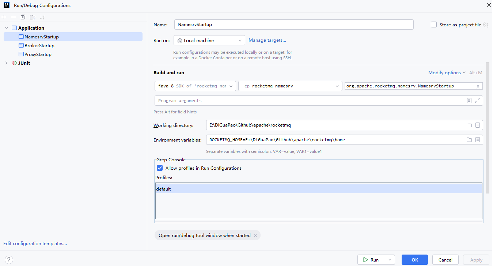
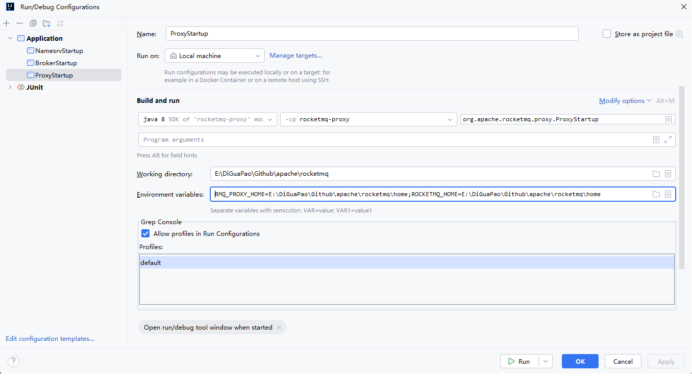
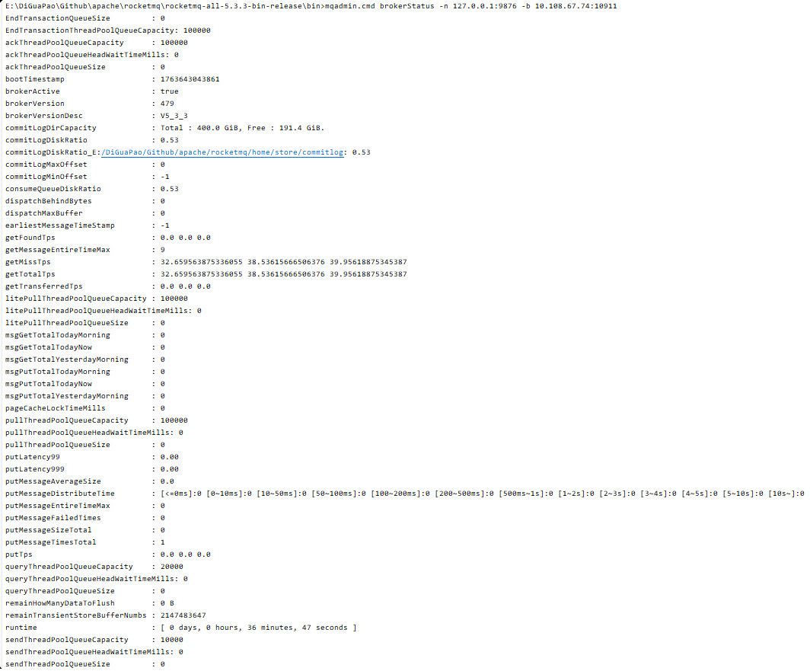
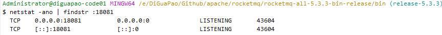
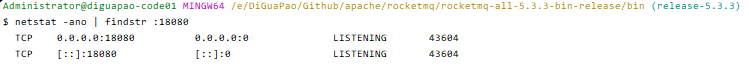
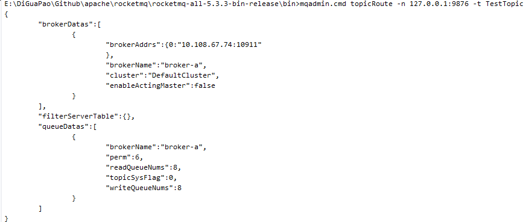

# 搭建源码调试环境

## 启动

基于 IntelliJ IDEA 2024.1.7 搭建，rocketmq 5.3.3 源码。

源码位于：

E:\DiGuaPao\Github\apache\rocketmq

创建目录：

E:\DiGuaPao\Github\apache\rocketmq\home


构建配置：


broker.conf

```conf
# Licensed to the Apache Software Foundation (ASF) under one or more
# contributor license agreements.  See the NOTICE file distributed with
# this work for additional information regarding copyright ownership.
# The ASF licenses this file to You under the Apache License, Version 2.0
# (the "License"); you may not use this file except in compliance with
# the License.  You may obtain a copy of the License at
#
#     http://www.apache.org/licenses/LICENSE-2.0
#
#  Unless required by applicable law or agreed to in writing, software
#  distributed under the License is distributed on an "AS IS" BASIS,
#  WITHOUT WARRANTIES OR CONDITIONS OF ANY KIND, either express or implied.
#  See the License for the specific language governing permissions and
#  limitations under the License.

namesrvAddr=127.0.0.1:9876

brokerClusterName = DefaultCluster
brokerName = broker-a
# Broker ID (0表示Master)
brokerId=0
deleteWhen = 04
fileReservedTime = 48
brokerRole = ASYNC_MASTER
flushDiskType = ASYNC_FLUSH

# 自动创建主题开关（确保开启）
autoCreateTopicEnable=true

# Broker监听地址和端口
listenPort=10911

# 存储路径（确保目录存在）
storePathRootDir=E:/DiGuaPao/Github/apache/rocketmq/home/store
storePathCommitLog=E:/DiGuaPao/Github/apache/rocketmq/home/store/commitlog
storePathConsumeQueue=E:/DiGuaPao/Github/apache/rocketmq/home/store/consumequeue
```


rmq-proxy.json

```json
{
  "集群配置": "",
  "proxyMode": "cluster",
  "clusterName": "DefaultCluster",
  "namesrvAddr": "127.0.0.1:9876",
  "主要端口配置": "",
  "gRPC 服务端口": "",
  "grpcServerPort": 18081,
  "Remoting 服务端口": "",
  "remotingServerPort": 18080,
  "HTTP 服务端口（如果启用）": "",
  "httpServerPort": 18082,
  "Admin 端口（管理接口）": "",
  "adminPort": 18083,
  "网络配置": "",
  "remotingListenPort": 18080,
  "线程配置": "",
  "grpcThreadPoolNums": 16,
  "grpcThreadPoolQueueCapacity": 10000,
  "超时配置": "",
  "channelExpiredTimeout": 60000,
  "heartbeatTimeoutMills": 30000,
  "消息大小限制": "",
  "maxMessageSize": 65536,
  "haProxyProtocolEnabled": false
}
```


### namesrv

配置如下



运行 org.apache.rocketmq.namesrv.NamesrvStartup#main 启动 namesrv


### broker

配置如下


运行 org.apache.rocketmq.namesrv.NamesrvStartup#main 启动 broker


### proxy

命令帮助：

```txt
usage: mqproxy [-bc <arg>] [-h] [-n <arg>] [-pc <arg>] [-pm <arg>]
 -bc,--brokerConfigPath <arg>   Broker config file path for local mode
 -h,--help                      Print help
 -n,--namesrvAddr <arg>         Name server address list, eg: '192.168.0.1:9876;192.168.0.2:9876'
 -pc,--proxyConfigPath <arg>    Proxy config file path
 -pm,--proxyMode <arg>          Proxy run in local or cluster mode
```


配置如下




环境变量：RMQ_PROXY_HOME=E:\DiGuaPao\Github\apache\rocketmq\home;ROCKETMQ_HOME=E:\DiGuaPao\Github\apache\rocketmq\home


运行 org.apache.rocketmq.proxy.ProxyStartup#main 启动 proxy


### 检查环境

```shell
# 打开cmd
# 进入bin目录
cd E:\DiGuaPao\Github\apache\rocketmq\rocketmq-all-5.3.3-bin-release\bin
## 临时设置环境变量（当前命令行有效）
set ROCKETMQ_HOME=E:\DiGuaPao\Github\apache\rocketmq\rocketmq-all-5.3.3-bin-release
set JAVA_HOME=E:\soft\jdk1.8\jdk1.8.0_221
# 查看集群列表
mqadmin.cmd clusterList -n 127.0.0.1:9876
```

如图所示：


```
# cmd 中继续执行
mqadmin.cmd topicList -n 127.0.0.1:9876
mqadmin.cmd brokerStatus -n 127.0.0.1:9876 -b 10.108.67.74:10911
```





打开gitbash

```sh
cd /e/DiGuaPao/Github/apache/rocketmq/rocketmq-all-5.3.3-bin-release/bin
netstat -ano | findstr :18081
netstat -ano | findstr :18080
```






#### **创建测试主题和消费者组**

##### 创建业务主题

```
# cmd 窗口
# 创建测试主题
mqadmin.cmd updateTopic -n 127.0.0.1:9876 -t TestTopic -c DefaultCluster

# 创建消费者组
mqadmin.cmd updateSubGroup -n 127.0.0.1:9876 -g TestConsumerGroup -c DefaultCluster
```


##### 验证主题创建

```
# cmd 窗口
# 查看主题路由信息
mqadmin.cmd topicRoute -n 127.0.0.1:9876 -t TestTopic
```




#### **测试消息发送和消费**

##### 使用命令行工具测试

```sh
# 新的cmd 窗口
cd E:\DiGuaPao\Github\apache\rocketmq\rocketmq-all-5.3.3-bin-release\bin
set ROCKETMQ_HOME=E:\DiGuaPao\Github\apache\rocketmq\rocketmq-all-5.3.3-bin-release
set JAVA_HOME=E:\soft\jdk1.8\jdk1.8.0_221
set NAMESRV_ADDR=127.0.0.1:9876
# 启动一个消费者（监听消息）
tools.cmd org.apache.rocketmq.example.quickstart.Consumer
```


```sh
# 在原窗口发送测试消息
set NAMESRV_ADDR=127.0.0.1:9876
tools.cmd org.apache.rocketmq.example.quickstart.Producer
```

