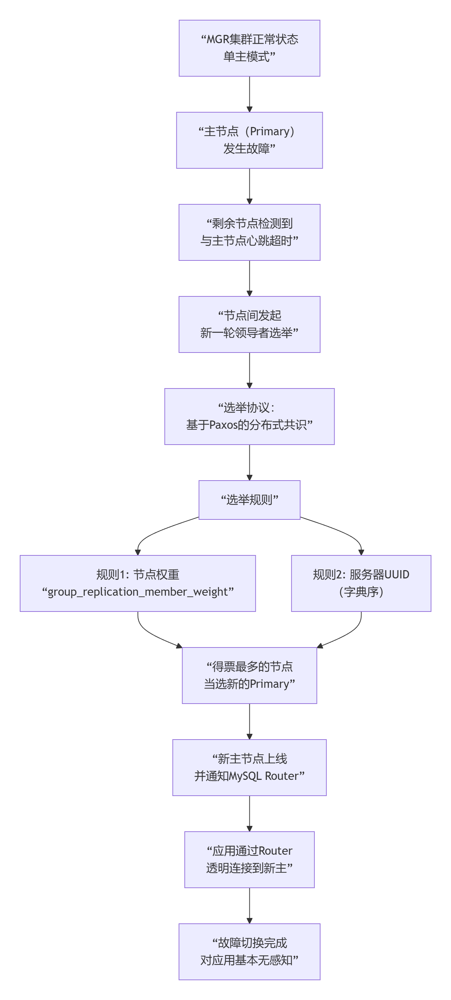

# MySQL8集群选主机制

***整理的内容需要去验证。***

***整理的内容需要去验证。***

***整理的内容需要去验证。***

在 MySQL 的生态中，**“选主”是由外部的集群管理组件或内置的共识算法来完成的**，而不是简单的“主从复制”本身。目前最主流、最核心的方案是 **MySQL Group Replication (MGR)**。

下图清晰地展示了基于 MGR 的 MySQL 集群如何进行自动选主与故障切换：

## 一、MySQL 如何实现自动选主？

MySQL 的自动选主主要依靠 MySQL Group Replication (MGR) 技术。您可以把它理解为 MySQL 内置的“Raft”或“Paxos”算法。

MGR 选主核心流程：

1.  故障检测（Failure Detection）
    ◦   集群中的每个节点都会通过心跳机制持续监控其他节点的状态。

    ◦   当主节点（Primary）宕机时，其他节点会在短时间内（通常几秒钟）检测到心跳超时。

2.  触发选举（Election Trigger）
    ◦   一旦确认主节点失联，集群会自动触发一次新的领导者选举。

3.  分布式投票（Consensus）
    ◦   剩余的所有节点会参与一次投票，基于 Paxos 协议达成共识。

    ◦   选举规则：

        ▪   节点权重：管理员可以预先为每个节点设置 group_replication_member_weight 参数（0-100），权重越高，优先级越高。这是最主要的选举依据。
        
        ▪   UUID 排序：如果权重相同，则比较节点的 server_uuid，字典序小的获胜。

4.  新主上线（New Primary Online）
    ◦   选举出的新主节点会自动切换为 Primary 模式，开始处理写请求。

    ◦   其他节点自动切换为 Secondary 模式，从新主节点同步数据。

## 二、MGR 的选主模式

MGR 支持两种模式，直接影响选主行为：

模式 工作机制 选主特点

单主模式 同一时间只有一个节点可写 自动选主。主库宕机后，集群自动从从库中选举新主。

多主模式 所有节点都可读可写 无需选主。任何节点宕机，其他节点继续提供服务。

生产环境强烈推荐使用“单主模式”，因为它避免了数据冲突，逻辑更简单。

## 三、完整的高可用架构：MySQL InnoDB Cluster

在实际生产中，MGR 通常与 MySQL Shell 和 MySQL Router 组合，构成完整的 MySQL InnoDB Cluster 解决方案：

组件 角色 职责

MGR (MySQL Group Replication) 数据层 负责数据同步、故障检测、自动选主。

MySQL Router 路由层 应用连接的入口。自动将写请求转发给主库，读请求可转发给从库。故障切换后，它能自动感知新主节点。

MySQL Shell 管理层 用于创建和管理集群。

故障切换与选主流程：
1.  主节点宕机。
2.  MGR 集群内部自动检测并选举出新主。
3.  MySQL Router 通过元数据自动发现新主节点。
4.  应用程序无需修改配置，通过 MySQL Router 连接时，会被自动引导到新的主节点。

## 四、操作示例

1. 查看集群状态（选主前）

SELECT * FROM performance_schema.replication_group_members;

结果可能类似：

| CHANNEL_NAME | MEMBER_ID | MEMBER_HOST | MEMBER_PORT | MEMBER_STATE | MEMBER_ROLE |
|--------------|-----------|-------------|-------------|--------------|-------------|
| group_replication_applier | 1234... | db1 | 3306 | ONLINE | PRIMARY | <-- 主库
| group_replication_applier | 5678... | db2 | 3306 | ONLINE | SECONDARY |
| group_replication_applier | 9012... | db3 | 3306 | ONLINE | SECONDARY |

2. 模拟主库宕机后，再次查看

SELECT * FROM performance_schema.replication_group_members;

结果变为：

| CHANNEL_NAME | MEMBER_ID | MEMBER_HOST | MEMBER_PORT | MEMBER_STATE | MEMBER_ROLE |
|--------------|-----------|-------------|-------------|--------------|-------------|
| group_replication_applier | 1234... | db1 | 3306 | UNREACHABLE | SECONDARY | <-- 原主库，失联
| group_replication_applier | 5678... | db2 | 3306 | ONLINE | PRIMARY | <-- 新当选的主库
| group_replication_applier | 9012... | db3 | 3306 | ONLINE | SECONDARY |

3. 设置节点权重（选主优先级）

-- 在 db2 上执行，将其权重设为最高（100）
SET GLOBAL group_replication_member_weight = 100;

## 总结

• 选主机制：MySQL 通过 MGR 的分布式共识算法实现自动选主，依据是节点权重和 UUID。

• 高可用架构：完整的方案是 MySQL InnoDB Cluster（MGR + MySQL Router + MySQL Shell），实现故障自动切换、应用无感知。

• 核心优势：真正意义上的高可用，故障切换通常在 30秒内 完成，对业务透明。

这种机制与之前讨论的 RocketMQ Controller 的选主类似，都是通过独立的集群管理组件和共识算法来确保只有一个主节点，从而避免脑裂，实现高可用。