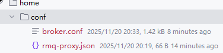
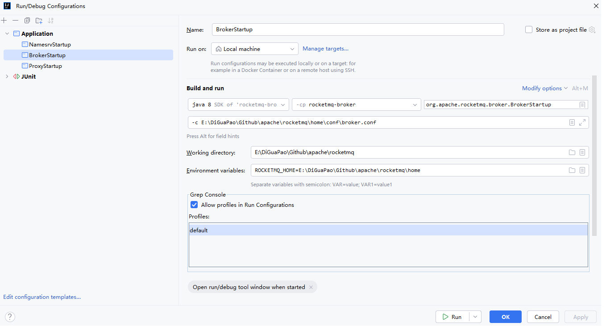
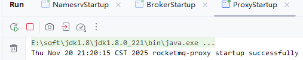
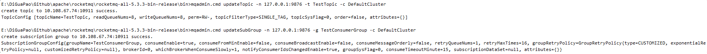
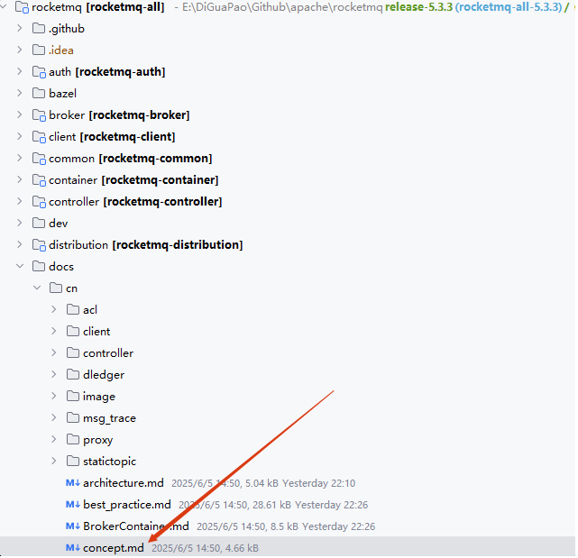
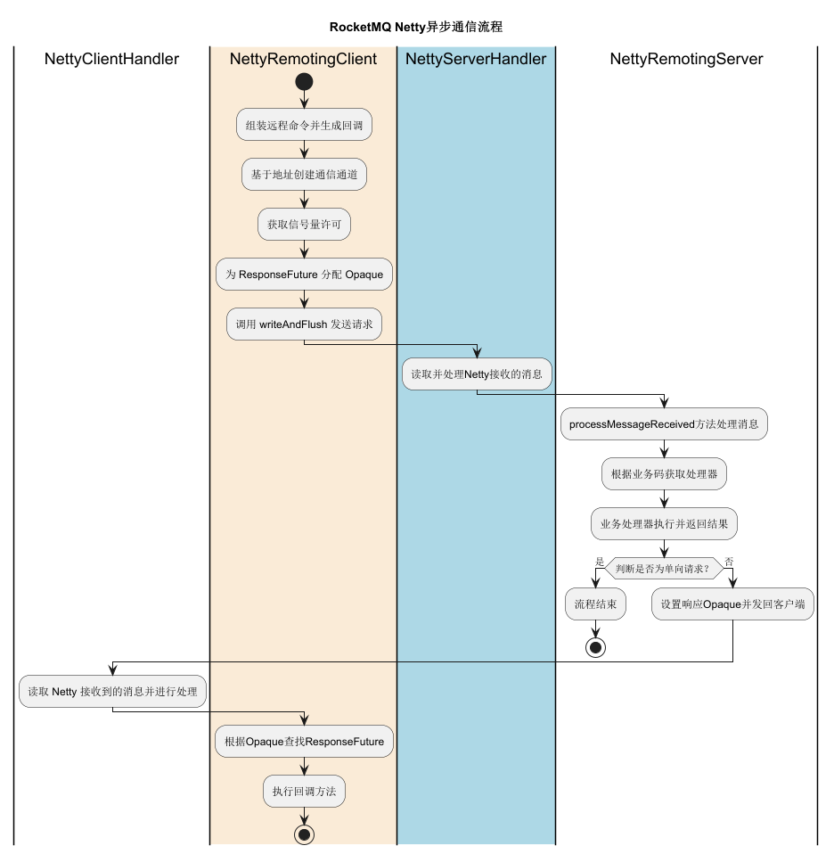
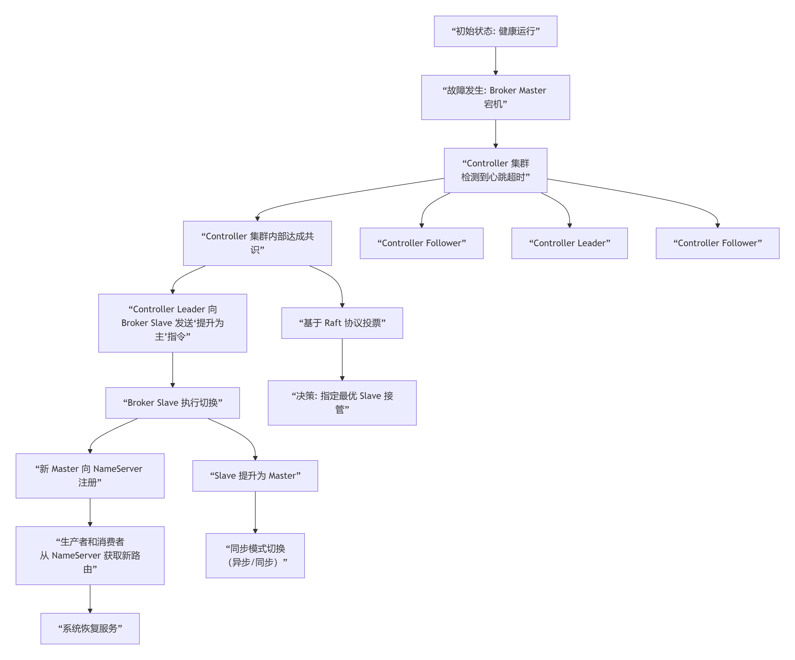

# 搭建源码调试环境

我们可以参考官方的部署架构来搭建本地源码的调试环境。

[rocketmq/docs/cn/architecture.md at release-5.3.3 · apache/rocketmq · GitHub](https://github.com/apache/rocketmq/blob/release-5.3.3/docs/cn/architecture.md)


## 准备工作

基于 IntelliJ IDEA 2024.1.7 搭建，rocketmq 5.3.3 源码。

源码位于：

E:\DiGuaPao\Github\apache\rocketmq

创建目录：

E:\DiGuaPao\Github\apache\rocketmq\home

构建配置：



broker.conf

```conf
# Licensed to the Apache Software Foundation (ASF) under one or more
# contributor license agreements.  See the NOTICE file distributed with
# this work for additional information regarding copyright ownership.
# The ASF licenses this file to You under the Apache License, Version 2.0
# (the "License"); you may not use this file except in compliance with
# the License.  You may obtain a copy of the License at
#
#     http://www.apache.org/licenses/LICENSE-2.0
#
#  Unless required by applicable law or agreed to in writing, software
#  distributed under the License is distributed on an "AS IS" BASIS,
#  WITHOUT WARRANTIES OR CONDITIONS OF ANY KIND, either express or implied.
#  See the License for the specific language governing permissions and
#  limitations under the License.

#namesrvAddr多个地址采用英文分号;隔开
namesrvAddr=127.0.0.1:9876

brokerClusterName = DefaultCluster
brokerName = broker-a
# Broker ID (0表示Master)
brokerId=0
deleteWhen = 04
fileReservedTime = 48
brokerRole = ASYNC_MASTER
flushDiskType = ASYNC_FLUSH

# 自动创建主题开关（确保开启）
autoCreateTopicEnable=true

# Broker监听地址和端口
listenPort=10911

# 存储路径（确保目录存在）
storePathRootDir=E:/DiGuaPao/Github/apache/rocketmq/home/store
storePathCommitLog=E:/DiGuaPao/Github/apache/rocketmq/home/store/commitlog
storePathConsumeQueue=E:/DiGuaPao/Github/apache/rocketmq/home/store/consumequeue
```

rmq-proxy.json

```json
{
  "集群配置": "proxyMode=Local时，proxy会内嵌一个broker，因此无需单独再部署broker了",
  "proxyMode": "Cluster",
  "clusterName": "DefaultCluster",
  "特别注意": "namesrvAddr多个地址采用英文分号;隔开",
  "namesrvAddr": "127.0.0.1:9876",
  "主要端口配置": "",
  "gRPC 服务端口": "",
  "grpcServerPort": 18081,
  "Remoting 服务端口": "",
  "remotingServerPort": 18080,
  "HTTP 服务端口（如果启用）": "",
  "httpServerPort": 18082,
  "Admin 端口（管理接口）": "",
  "adminPort": 18083,
  "网络配置": "",
  "remotingListenPort": 18080,
  "线程配置": "",
  "grpcThreadPoolNums": 16,
  "grpcThreadPoolQueueCapacity": 10000,
  "超时配置": "",
  "channelExpiredTimeout": 60000,
  "heartbeatTimeoutMills": 30000,
  "消息大小限制": "",
  "maxMessageSize": 65536,
  "haProxyProtocolEnabled": false
}
```

## 启动namesrv

配置如下


运行 org.apache.rocketmq.namesrv.NamesrvStartup#main 启动 namesrv


## 启动broker

配置如下



运行 org.apache.rocketmq.namesrv.NamesrvStartup#main 启动 broker


## 启动proxy

命令帮助：

```txt
usage: mqproxy [-bc <arg>] [-h] [-n <arg>] [-pc <arg>] [-pm <arg>]
 -bc,--brokerConfigPath <arg>   Broker config file path for local mode
 -h,--help                      Print help
 -n,--namesrvAddr <arg>         Name server address list, eg: '192.168.0.1:9876;192.168.0.2:9876'
 -pc,--proxyConfigPath <arg>    Proxy config file path
 -pm,--proxyMode <arg>          Proxy run in local or cluster mode
```

配置如下


环境变量：RMQ_PROXY_HOME=E:\DiGuaPao\Github\apache\rocketmq\home;ROCKETMQ_HOME=E:\DiGuaPao\Github\apache\rocketmq\home

运行 org.apache.rocketmq.proxy.ProxyStartup#main 启动 proxy



## 检查环境

```shell
:: 打开cmd
:: 进入bin目录
cd E:\DiGuaPao\Github\apache\rocketmq\rocketmq-all-5.3.3-bin-release\bin
:: 临时设置环境变量（当前命令行有效）
set ROCKETMQ_HOME=E:\DiGuaPao\Github\apache\rocketmq\rocketmq-all-5.3.3-bin-release
set JAVA_HOME=E:\soft\jdk1.8\jdk1.8.0_221
:: 查看集群列表
mqadmin.cmd clusterList -n 127.0.0.1:9876
```

如图所示：


```
# cmd 中继续执行
mqadmin.cmd topicList -n 127.0.0.1:9876
mqadmin.cmd brokerStatus -n 127.0.0.1:9876 -b 10.108.67.74:10911
```


打开gitbash

```sh
cd /e/DiGuaPao/Github/apache/rocketmq/rocketmq-all-5.3.3-bin-release/bin
netstat -ano | findstr :18081
netstat -ano | findstr :18080
```


### **创建测试主题和消费者组**

### 创建业务主题

```
# cmd 窗口
# 创建测试主题
mqadmin.cmd updateTopic -n 127.0.0.1:9876 -t TestTopic -c DefaultCluster

# 创建消费者组
mqadmin.cmd updateSubGroup -n 127.0.0.1:9876 -g TestConsumerGroup -c DefaultCluster
```



### 验证主题创建

```
# cmd 窗口
# 查看主题路由信息
mqadmin.cmd topicRoute -n 127.0.0.1:9876 -t TestTopic
```


### **测试消息发送和消费**

#### 使用命令行工具测试

```sh
# 新的cmd 窗口
cd E:\DiGuaPao\Github\apache\rocketmq\rocketmq-all-5.3.3-bin-release\bin
set ROCKETMQ_HOME=E:\DiGuaPao\Github\apache\rocketmq\rocketmq-all-5.3.3-bin-release
set JAVA_HOME=E:\soft\jdk1.8\jdk1.8.0_221
set NAMESRV_ADDR=127.0.0.1:9876
# 启动一个消费者（监听消息）
tools.cmd org.apache.rocketmq.example.quickstart.Consumer
```

```sh
# 在原窗口发送测试消息
set NAMESRV_ADDR=127.0.0.1:9876
tools.cmd org.apache.rocketmq.example.quickstart.Producer
```

本地调试RocketMQ官方文档：[rocketmq/docs/cn/Debug_In_Idea.md at release-5.3.3 · apache/rocketmq · GitHub](https://github.com/apache/rocketmq/blob/release-5.3.3/docs/cn/Debug_In_Idea.md)

# 基本概念与特性强化

基本概念官方文档如图所示，可以参见 [rocketmq/docs/cn/concept.md at release-5.3.3 · apache/rocketmq · GitHub](https://github.com/apache/rocketmq/blob/release-5.3.3/docs/cn/concept.md)



## 消息模型（Message Model）

RocketMQ主要由 Producer、Broker、Consumer 三部分组成，其中Producer 负责生产消息，Consumer 负责消费消息，Broker 负责存储消息。Broker 在实际部署过程中对应一台服务器，每个 Broker
可以存储多个Topic的消息，每个Topic的消息也可以分片存储于不同的 Broker。Message Queue 用于存储消息的物理地址，每个Topic中的消息地址存储于多个 Message Queue 中。ConsumerGroup 由多个Consumer
实例构成。


特性官方文档：[rocketmq/docs/cn/features.md at release-5.3.3 · apache/rocketmq · GitHub](https://github.com/apache/rocketmq/blob/release-5.3.3/docs/cn/features.md)

# 熟悉系统设计

## 架构设计

[rocketmq/docs/cn/architecture.md at release-5.3.3 · apache/rocketmq · GitHub](https://github.com/apache/rocketmq/blob/release-5.3.3/docs/cn/architecture.md)

## 详细设计

[rocketmq/docs/cn/design.md at release-5.3.3 · apache/rocketmq · GitHub](https://github.com/apache/rocketmq/blob/release-5.3.3/docs/cn/design.md)


### 消息的通信方式和流程




# 参考资料

不得不说，rocketmq 的技术文档写得非常好。

非常推荐 Apache RocketMQ开发者指南：[rocketmq/docs/cn/README.md at release-5.3.3 · apache/rocketmq · GitHub](https://github.com/apache/rocketmq/blob/release-5.3.3/docs/cn/README.md)


# 整理的内容

***整理的内容需要去验证。***

***整理的内容需要去验证。***

***整理的内容需要去验证。***


## **Controller 集群**和 **Broker 集群**是如何协同工作来完成主从切换的？


### **核心角色分工**

首先，咱们要清晰理解 RocketMQ 5.x 中引入的这几个核心角色：

| 角色                | 职责                                                         | 类比                                             |
| :------------------ | :----------------------------------------------------------- | :----------------------------------------------- |
| **Controller 集群** | **集群的“大脑”**。负责监控 Broker 状态，在 Master 宕机时，**决策**并**指挥**哪个 Slave 接管。 | 像 Kubernetes 的 Control Plane，负责调度和管理。 |
| **Broker 集群**     | **集群的“手脚”**。负责消息的存储和传输。它们接受 Controller 的指令。 | 像 Kubernetes 的 Pod，负责实际运行业务。         |
| **NameServer**      | **集群的“电话簿”**。记录 Broker 的主从信息路由，供客户端查询。 | 像 DNS 服务器，只负责服务发现，不参与决策。      |

**关键思想：** RocketMQ 5.x 将 **“决策”（Controller）** 和 **“执行”（Broker）** 分离了。之前版本的 Broker 主从切换是 Broker 之间通过 HA 协议自己协商（类似于旧版 MySQL 主从），而 5.x 版本引入了一个独立的“决策层”（Controller）。

------

### 详细协作流程（如图从右往左看）




假设我们有一个 Broker 集群 `broker-a`，配置为一主（`broker-a-0`）两从（`broker-a-1`， `broker-a-2`）。

#### **第 1 步：正常运行时（心跳检测）**

1. 所有 Broker（Master 和 Slave）**定期**向 **Controller 集群的 Leader 节点**发送心跳。
2. 心跳信息包括：我是谁（`broker-a-0`），我的角色（Master），我的同步状态等。
3. Controller Leader 维护着整个集群的 Broker 状态视图。

#### **第 2 步：Master 宕机（故障检测）**

1. Broker Master（`broker-a-0`）因为某种原因（机器宕机、网络分区、进程退出）停止发送心跳。
2. Controller Leader 在**超过一定时间**（可配置）未收到心跳后，会将该 Broker 标记为“不可用”。

#### **第 3 步：Controller 集群决策（选主仲裁）**

这是最核心的一步。Controller 集群**内部**会执行以下操作：

1. **共识达成**：Controller Leader 会通知其他 Follower 节点：“`broker-a-0`失联了，我们需要为 `broker-a`集群选举新的 Master”。
2. **选举新主**：Controller 集群会根据预设规则**从存活的 Slave 中选出新的 Master**。选举规则包括：
   - **优先级**：每个 Broker 可配置 `brokerPriority`，值越大优先级越高。
   - **复制进度**：选择与原 Master 数据同步差距最小的 Slave（`maxOffset`最大）。
   - **节点ID**：作为最后的排序条件。
3. **做出决策**：例如，Controller 判断 `broker-a-1`是最优的继任者。

#### **第 4 步：指令下发与执行（故障恢复）**

1. **下发指令**：Controller Leader 向被选中的 Slave（`broker-a-1`）发送一条 **`ElectMaster`** 的指令，命令其提升为 Master。
2. **执行切换**：`broker-a-1`收到指令后：
   - 将自己的角色从 Slave 切换为 Master。
   - 开始接受生产者和消费者的连接。
3. **通知 NameServer**：新的 Master（`broker-a-1`）立即向 NameServer 注册自己的路由信息（表明自己是新的 Master）。
4. **客户端更新**：生产者和消费者从 NameServer 拉取到最新的路由信息，知道 Master 已经变成了 `broker-a-1`，于是将消息发送到新的 Master。

------

### **为什么这种架构更优秀？**

1. **避免脑裂**：在传统的主从切换中，多个 Slave 可能同时尝试提升自己为 Master，导致脑裂。现在由**唯一的权威机构（Controller 集群）** 来指定新主，从根本上杜绝了脑裂。
2. **更快更智能**：Controller 拥有全局视角，可以基于**复制进度、优先级**等智能选择最优的 Slave 作为新主，而不仅仅是第一个检测到 Master 宕机的 Slave。
3. **解耦与专业化**：Broker 只负责消息存储和传输，Controller 专门负责高可用性管理，系统更加清晰和健壮。

### **总结**

咱们可以这样理解：

- **Controller 集群** 就像公司的 **CEO 和董事会**，负责制定战略和重大人事任免（决定谁当部门经理）。
- **Broker 集群** 就像公司的 **各个业务部门**，负责具体干活（处理业务）。
- **NameServer** 就像公司的 **总机接线员**，只负责告诉客户现在该找哪个部门经理。

当 Broker Master 这个“部门经理”突然离职时，CEO（Controller Leader）会迅速介入，从副经理（Slave）中挑选最合适的一位接任，并通知全公司和总机。这样就完成了一次平稳、可控的权力交接。

这种基于 Controller 的架构，正是 RocketMQ 5.x 为实现金融级高可用而设计的核心特性。
