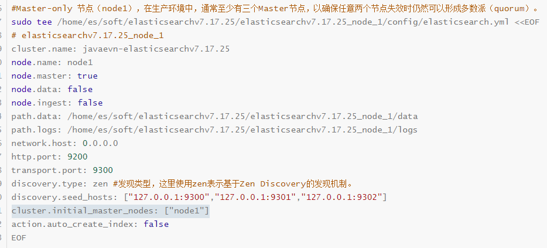

# 基于 centos 搭建 java 开发常见的中间件与依赖服务环境

## 设置国内源

```shell
sudo mv /etc/yum.repos.d/CentOS-Base.repo /etc/yum.repos.d/CentOS-Base.repo_def
curl -o /etc/yum.repos.d/CentOS-Base.repo http://mirrors.aliyun.com/repo/Centos-7.repo
#或者
vi /etc/yum.repos.d/CentOS-Base.repo
#键入以下内容保存退出
# CentOS-Base.repo
#
# The mirror system uses the connecting IP address of the client and the
# update status of each mirror to pick mirrors that are updated to and
# geographically close to the client.  You should use this for CentOS updates
# unless you are manually picking other mirrors.
#
# If the mirrorlist= does not work for you, as a fall back you can try the 
# remarked out baseurl= line instead.
#
#
 
[base]
name=CentOS-$releasever - Base - mirrors.aliyun.com
failovermethod=priority
baseurl=http://mirrors.aliyun.com/centos/$releasever/os/$basearch/
        http://mirrors.aliyuncs.com/centos/$releasever/os/$basearch/
        http://mirrors.cloud.aliyuncs.com/centos/$releasever/os/$basearch/
gpgcheck=1
gpgkey=http://mirrors.aliyun.com/centos/RPM-GPG-KEY-CentOS-7
 
#released updates 
[updates]
name=CentOS-$releasever - Updates - mirrors.aliyun.com
failovermethod=priority
baseurl=http://mirrors.aliyun.com/centos/$releasever/updates/$basearch/
        http://mirrors.aliyuncs.com/centos/$releasever/updates/$basearch/
        http://mirrors.cloud.aliyuncs.com/centos/$releasever/updates/$basearch/
gpgcheck=1
gpgkey=http://mirrors.aliyun.com/centos/RPM-GPG-KEY-CentOS-7
 
#additional packages that may be useful
[extras]
name=CentOS-$releasever - Extras - mirrors.aliyun.com
failovermethod=priority
baseurl=http://mirrors.aliyun.com/centos/$releasever/extras/$basearch/
        http://mirrors.aliyuncs.com/centos/$releasever/extras/$basearch/
        http://mirrors.cloud.aliyuncs.com/centos/$releasever/extras/$basearch/
gpgcheck=1
gpgkey=http://mirrors.aliyun.com/centos/RPM-GPG-KEY-CentOS-7
 
#additional packages that extend functionality of existing packages
[centosplus]
name=CentOS-$releasever - Plus - mirrors.aliyun.com
failovermethod=priority
baseurl=http://mirrors.aliyun.com/centos/$releasever/centosplus/$basearch/
        http://mirrors.aliyuncs.com/centos/$releasever/centosplus/$basearch/
        http://mirrors.cloud.aliyuncs.com/centos/$releasever/centosplus/$basearch/
gpgcheck=1
enabled=0
gpgkey=http://mirrors.aliyun.com/centos/RPM-GPG-KEY-CentOS-7
 
#contrib - packages by Centos Users
[contrib]
name=CentOS-$releasever - Contrib - mirrors.aliyun.com
failovermethod=priority
baseurl=http://mirrors.aliyun.com/centos/$releasever/contrib/$basearch/
        http://mirrors.aliyuncs.com/centos/$releasever/contrib/$basearch/
        http://mirrors.cloud.aliyuncs.com/centos/$releasever/contrib/$basearch/
gpgcheck=1
enabled=0
gpgkey=http://mirrors.aliyun.com/centos/RPM-GPG-KEY-CentOS-7

#更新源
sudo yum clean all
sudo yum makecache
sudo yum update
```


## 部署 MariaDB 11.4

使用 MariaDB 11.4 代替 MySQL Server

官方文档地址：[下载 MariaDB 服务器 - MariaDB.org](https://mariadb.org/download/?t=repo-config&d=CentOS+7&v=11.4&r_m=serverion)

```shell
#安装EPEL仓库
sudo yum install epel-release

# 安装pv工具
sudo yum install pv

# 要在centos系统中导入MariaDB仓库密钥，需要执行以下命令
vi /etc/yum.repos.d/MariaDB.repo
#键入已下内容保存退出
# MariaDB 11.4 CentOS repository list - created 2024-10-29 02:59 UTC
# https://mariadb.org/download/
[mariadb]
name = MariaDB
# rpm.mariadb.org is a dynamic mirror if your preferred mirror goes offline. See https://mariadb.org/mirrorbits/ for details.
# baseurl = https://rpm.mariadb.org/11.4/centos/$releasever/$basearch
baseurl = https://mirror.serverion.com/mariadb/yum/11.4/centos/$releasever/$basearch
module_hotfixes = 1
# gpgkey = https://rpm.mariadb.org/RPM-GPG-KEY-MariaDB
gpgkey = https://mirror.serverion.com/mariadb/yum/RPM-GPG-KEY-MariaDB
gpgcheck = 1

#安装
sudo yum install MariaDB-server MariaDB-client
#验证
mariadb -V

sudo systemctl enable mariadb && sudo systemctl start mariadb && sudo systemctl status mariadb
# sudo systemctl stop mariadb
# sudo systemctl restart mariadb

# 检查服务日志
sudo journalctl -u mariadb

# 设置远程访问
vi /etc/my.cnf.d/server.cnf
# bind-address = 127.0.0.1 修改为 bind-address = 0.0.0.0

# 开启root远程连接
sudo mysql -u root -p
# 不知道密码，直接回车，然后执行以下命令
USE mysql;
ALTER USER 'root'@'localhost' IDENTIFIED BY 'root';
FLUSH PRIVILEGES;
EXIT;
#使用新密码登陆
mysql -u root -proot
#授予root用户远程(任意IP)登录权限
GRANT ALL PRIVILEGES ON *.* TO 'root'@'%' IDENTIFIED BY '新密码' WITH GRANT OPTION;
FLUSH PRIVILEGES;

#重启mariadb
sudo systemctl restart mariadb

#防火墙放行
sudo firewall-cmd --permanent --add-port=3306/tcp
sudo firewall-cmd --reload
#关闭iptables
sudo systemctl stop firewalld && sudo systemctl disable firewalld

#确保您的防火墙允许TCP端口3306上的流量
sudo ss -tulnp | grep 3306

# 验证远程连接
mysql -uroot -proot -h 192.168.11.66 -P 3306

#阻止 mariadb 自动升级
vi /etc/yum.conf
#追加
exclude=mariadb* MariaDB*

#！！！！！ 卸载
#sudo systemctl stop mariadb
#sudo yum remove mariadb-server mariadb-client mariadb-common # 卸载MariaDB软件包
#sudo yum remove $(rpm -qa | grep mariadb)
#sudo rm -rf /var/lib/mysql #删除MariaDB数据和配置文件
#sudo rm -rf /var/log/mariadb
#sudo rm -rf /etc/mysql /etc/systemd/system/mariadb.service.d
#sudo rm -f /usr/lib/systemd/system/mariadb.service
#sudo groupdel mysql
#sudo userdel mysql
#sudo sed -i '/^export JAVA_HOME/d' ~/.bashrc
#sudo sed -i '/^export PATH/d' ~/.bashrc
#sudo source ~/.bashrc
#sudo yum clean all
#find / -name "mariadb" 2>/dev/null
#sudo systemctl daemon-reload
```


## 部署 MongoDB Community Edition 6.0

官方文档：[在 Red Hat 或 CentOS 上安装 MongoDB Community Edition - MongoDB 手册 v6.0](https://www.mongodb.com/zh-cn/docs/v6.0/tutorial/install-mongodb-on-red-hat/)

```shell
vi /etc/yum.repos.d/mongodb-org-6.0.repo
#键入以下内容后保存
[mongodb-org-6.0]
name=MongoDB Repository
baseurl=https://repo.mongodb.org/yum/redhat/7/mongodb-org/6.0/x86_64/
gpgcheck=1
enabled=1
gpgkey=https://pgp.mongodb.com/server-6.0.asc

#安装
#sudo yum install -y mongodb-org
#安装特定版本
sudo yum install -y mongodb-org-6.0.17 mongodb-org-database-6.0.17 mongodb-org-server-6.0.17 mongodb-org-mongos-6.0.17 mongodb-org-tools-6.0.17

#阻止mongodb自动升级
vi /etc/yum.conf
#追加
exclude=mongodb-org,mongodb-org-database,mongodb-org-server,mongodb-mongosh,mongodb-org-mongos,mongodb-org-tools

#启动
sudo systemctl enable mongod && sudo systemctl daemon-reload && sudo systemctl start mongod && sudo systemctl status mongod

# 设置可远程访问、帐户和密码
# 进入命令行
mongosh
# 选择数据库admin
use admin
# 创建账户
db.createUser({ user: "admin", pwd: "admin", roles: [ { role: "root", db: "admin" } ] })

# 修改配置
vi /etc/mongod.conf
# 修改 bindIp: 127.0.0.1 为 bindIp: 0.0.0.0
# 并添加一下内容
security:
  authorization: enabled

#重启mongod
systemctl restart mongod && sudo systemctl status mongod

#查看正在运行的 mongodb 进程
ps -ef | grep mongod

#防火墙放行
sudo firewall-cmd --permanent --add-port=27017/tcp
sudo firewall-cmd --reload
```

### 相关目录

日志：/var/log/mongodb/mongod.log

配置文件 /etc/mongod.conf

数据目录 /var/lib/mongo

日志目录 /var/log/mongodb


## 部署 Redis 7.0.2

```shell

# 首先安装依赖gcc, 后面需要使用make编译redis
yum install gcc -y

# 创建进入 /usr/local/redis 目录, 把源码下载到这里
sudo mkdir -p /usr/local/redis && cd /usr/local/redis

# 下载 redis 7.0.2 的源码,github被墙,可以使用国内的地址
curl -o redis-7.0.2.tar.gz  http://download.redis.io/releases/redis-7.0.2.tar.gz

# 解压缩
tar zxvf redis-7.0.2.tar.gz

# 进入解压后的文件夹
cd redis-7.0.2

# 编译并安装 redis, 漫长的等待...
make && make install

# 安装完成后，redis会被默认安装在 /usr/local/bin/
# 查看下这个目录下的文件,可以看到有 redis-server, 这个文件就是redis的服务程序了
ls /usr/local/bin/

# 启动 Redis
# 因为redis被默认安装在/usr/local/bin,这个目录默认就在系统的环境变量中(不信，你可以使用 env 命令,查看一下你的 PATH 是不是有)
# 所以,我们可以在任意位置运行 redis-server 来启动 redis
redis-server #注意这是前台启动

#修改配置
cp /usr/local/redis/redis-7.0.2/redis.conf /usr/local/redis/redis-7.0.2/redis.conf_bak
vi /usr/local/redis/redis-7.0.2/redis.conf
# 后台启动：daemonize yes
# 设置密码：requirepass 你的密码
# 设置端口：port 6379
# 远程访问：bind 0.0.0.0

#开机自启
sudo tee /etc/systemd/system/redis.service <<EOF
[Unit]
Description=redis-server
After=network.target

[Service]
Type=forking

ExecStart=/usr/local/bin/redis-server /usr/local/redis/redis-7.0.2/redis.conf
PrivateTmp=true

[Install]
WantedBy=multi-user.target

EOF

#重新加载系统服务并设置redis开机自启
systemctl daemon-reload && systemctl enable redis

#启动，停止，卸载，查看状态
# 启动redis服务
systemctl start redis

# 查看服务状态
systemctl status redis

# 停止服务
systemctl stop redis

# 取消开机自动启动(卸载服务)
systemctl disabled redis

#查看正在运行的redis进程
ps -ef | grep redis

#防火墙放行
sudo firewall-cmd --permanent --add-port=6379/tcp
sudo firewall-cmd --reload
```


## 部署 Openjdk8

```shell
# ！！！ 在后期部署 es 过程中发现，Openjdk8 不宜部署在 root 目录下
sudo mkdir -p /usr/local/jdk/openjdk8 && cd /usr/local/jdk/openjdk8

curl -o OpenJDK8U-jdk_x64_linux_hotspot_8u372b08.tar.gz https://github.com/adoptium/temurin8-binaries/releases/download/jdk8u422-b05/OpenJDK8U-jdk_x64_linux_hotspot_8u422b05.tar.gz

tar zxvf OpenJDK8U-jdk_x64_linux_hotspot_8u422b05.tar.gz
cd jdk8u422-b05

sudo vi /etc/profile
#在文件末尾添加：
export JAVA_HOME=/usr/local/jdk/openjdk8/jdk8u422-b05
export PATH=$JAVA_HOME/bin:$PATH
#使配置生效
source /etc/profile

vi ~/.bashrc
#在文件末尾添加：
export JAVA_HOME=/usr/local/jdk/openjdk8/jdk8u422-b05
export PATH=$JAVA_HOME/bin:$PATH
#使配置生效
source ~/.bashrc

#验证
java -version
```


## 部署 Maven 3.9.9

```shell
# ！！！ 不宜部署在 root 目录下
sudo mkdir -p /usr/local/maven && cd /usr/local/maven

curl -o apache-maven-3.9.9-bin.tar.gz https://dlcdn.apache.org/maven/maven-3/3.9.9/binaries/apache-maven-3.9.9-bin.tar.gz

tar zxvf apache-maven-3.9.9-bin.tar.gz
cd apache-maven-3.9.9

sudo vi /etc/profile
#在文件末尾添加：
export M2_HOME=/usr/local/maven/apache-maven-3.9.9
export PATH=$M2_HOME/bin:$PATH
#使配置生效
source /etc/profile

vi ~/.bashrc
#在文件末尾添加：
export M2_HOME=/usr/local/maven/apache-maven-3.9.9
export PATH=$M2_HOME/bin:$PATH
#使配置生效
source ~/.bashrc

#验证
mvn -version

#设置 localRepository 
vi /usr/local/maven/apache-maven-3.9.9/conf/settings.xml
#调整为如下内容
<localRepository>/usr/local/maven/apache-maven-3.9.9/.m2/repository</localRepository>
```


## 部署 Nacos 2.4.3

```shell
sudo mkdir -p /usr/local/nacos && cd /usr/local/nacos
curl -o nacos-2.4.3.tar.gz https://github.com/alibaba/nacos/releases/download/2.4.3/nacos-server-2.4.3.tar.gz
tar zxvf nacos-server-2.4.3.tar.gz
cd nacos

#配置数据库
#导入脚本
sudo mariadb -u root -p -e "CREATE DATABASE nacos;"
sudo mariadb -u root -p nacos < /usr/local/nacos/nacos/conf/mysql-schema.sql

#配置数据库
vi /usr/local/nacos/nacos/conf/application.properties
#调整后的配置如下
#*************** Config Module Related Configurations ***************#
### If use MySQL as datasource:
### Deprecated configuration property, it is recommended to use `spring.sql.init.platform` replaced.
spring.datasource.platform=mysql
# spring.sql.init.platform=mysql

### Count of DB:
db.num=1

### Connect URL of DB:
db.url.0=jdbc:mysql://192.168.11.66:3306/nacos?characterEncoding=utf8&connectTimeout=1000&socketTimeout=3000&autoReconnect=true&useUnicode=true&useSSL=false&serverTimezone=UTC
db.user.0=root
db.password.0=root

#开机自启
sudo tee /etc/systemd/system/nacos.service <<EOF
[Unit]
Description=Nacos Server
After=network.target

[Service]
Type=forking
User=root
WorkingDirectory=/usr/local/nacos/nacos
Environment="JAVA_HOME=/usr/local/jdk/openjdk8/jdk8u422-b05"
Environment="NACOS_HOME=/usr/local/nacos/nacos"
ExecStart=/bin/bash /usr/local/nacos/nacos/bin/startup.sh -m standalone
ExecStop=/bin/bash /usr/local/nacos/nacos/bin/shutdown.sh
Restart=on-failure
StandardOutput=file:/usr/local/nacos/nacos/output.log

[Install]
WantedBy=multi-user.target
EOF

#重新加载systemd配置并设置开机自启
sudo systemctl daemon-reload && sudo systemctl enable nacos
#启动Nacos服务（这里看状态可能是：Active: failed，能访问就行）
sudo systemctl restart nacos && sudo systemctl status nacos

#防火墙开放端口
sudo firewall-cmd --permanent --add-port=8848/tcp
sudo firewall-cmd --reload
#查看开放的端口列表
firewall-cmd --list-port

#命名方式、单机模式启动
#bin/startup.sh -m standalone

#如果无法自动启动，则可手动启动
#打开一个新的ssh窗口执行
/usr/local/nacos/nacos/bin/startup.sh -m standalone

#查看启动日志
tail -f /usr/local/nacos/nacos/logs/start.out -n 500
#或
tail -f /usr/local/nacos/nacos/output.log -n 500

#验证是否启动
curl -L 127.0.0.1:8484/nacos/index.html
```


## 部署 xxl-job

```shell
sudo mkdir -p /usr/local/xxljob && cd /usr/local/xxljob

curl -o xxl-job-2.4.1.tar.gz https://github.com/xuxueli/xxl-job/archive/refs/tags/2.4.1.tar.gz

tar zxvf xxl-job-2.4.1.tar.gz
cd xxl-job-2.4.1

#配置数据库
#导入脚本
sudo mariadb -u root -p -e "CREATE DATABASE xxl_job;"
sudo mariadb -u root -p xxl_job < /usr/local/xxljob/xxl-job-2.4.1/doc/db/tables_xxl_job.sql

#修改 xxl_job 配置
vi /usr/local/xxljob/xxl-job-2.4.1/xxl-job-admin/src/main/resources/application.properties
#调整端口：server.port=9997
#调整数据库配置如下：
### xxl-job, datasource
spring.datasource.url=jdbc:mysql://127.0.0.1:3306/xxl_job?useUnicode=true&characterEncoding=UTF-8&autoReconnect=true&serverTimezone=Asia/Shanghai
spring.datasource.username=root
spring.datasource.password=root
spring.datasource.driver-class-name=com.mysql.cj.jdbc.Driver

#修改执行器配置
vi /usr/local/xxljob/xxl-job-2.4.1/xxl-job-executor-samples/xxl-job-executor-sample-springboot/src/main/resources/application.properties
#调整如下配置：
# web port
server.port=9998
### xxl-job admin address list, such as "http://address" or "http://address01,http://address02"
xxl.job.admin.addresses=http://192.168.11.66:9997/xxl-job-admin

#防火墙开放端口
sudo firewall-cmd --permanent --add-port=9997/tcp
sudo firewall-cmd --reload
#查看开放的端口列表
firewall-cmd --list-port

#启动 xxl_job
cd /usr/local/xxljob/xxl-job-2.4.1/xxl-job-admin && mvn spring-boot:run -Dspring-boot.run.arguments=--spring.profiles.active=prod
cd /usr/local/xxljob/xxl-job-2.4.1/xxl-job-executor-samples/xxl-job-executor-sample-springboot && mvn spring-boot:run -Dspring-boot.run.arguments=--spring.profiles.active=prod

#开机自启 xxl_job_admin
sudo tee /etc/systemd/system/xxl_job_admin.service <<EOF
[Unit]
Description=XXL-Job Admin Service
After=network.target

[Service]
Type=forking
User=root
WorkingDirectory=/usr/local/xxljob/xxl-job-2.4.1/xxl-job-admin
Environment="JAVA_HOME=/usr/local/jdk/openjdk8/jdk8u422-b05"
ExecStart=/usr/local/maven/apache-maven-3.9.9/bin/mvn spring-boot:run
ExecStop=/bin/kill -s TERM $MAINPID
#SuccessExitStatus=143
Restart=on-failure
StandardOutput=file:/usr/local/xxljob/xxl-job-2.4.1/xxl-job-admin/output.log

[Install]
WantedBy=multi-user.target
EOF
#开机自启 xxl_job_executor
sudo tee /etc/systemd/system/xxl_job_executor.service <<EOF
[Unit]
Description=XXL-Job Executor Service
After=network.target

[Service]
Type=forking
User=root
WorkingDirectory=/usr/local/xxljob/xxl-job-2.4.1/xxl-job-executor-samples/xxl-job-executor-sample-springboot
Environment="JAVA_HOME=/usr/local/jdk/openjdk8/jdk8u422-b05"
ExecStart=/usr/local/maven/apache-maven-3.9.9/bin/mvn spring-boot:run
ExecStop=/bin/kill -s TERM $MAINPID
#SuccessExitStatus=143
Restart=on-failure
StandardOutput=file:/usr/local/xxljob/xxl-job-2.4.1/xxl-job-executor-samples/xxl-job-executor-sample-springboot/output.log

[Install]
WantedBy=multi-user.target
EOF

#重新加载systemd配置
sudo systemctl daemon-reload
#设置开机启动并启动服务，然后查看服务状态（Active: failed 没所谓）
sudo systemctl enable xxl_job_admin && sudo systemctl restart xxl_job_admin && sudo systemctl status xxl_job_admin
sudo systemctl enable xxl_job_executor && sudo systemctl restart xxl_job_executor && sudo systemctl status xxl_job_executor

#如果启不来，则可手动启动
cd /usr/local/xxljob/xxl-job-2.4.1/xxl-job-executor-samples/xxl-job-executor-sample-springboot && nohup /usr/local/maven/apache-maven-3.9.9/bin/mvn spring-boot:run > /usr/local/xxljob/xxl-job-2.4.1/xxl-job-executor-samples/xxl-job-executor-sample-springboot/output.log 2>&1 &
cd /usr/local/xxljob/xxl-job-2.4.1/xxl-job-admin && nohup /usr/local/maven/apache-maven-3.9.9/bin/mvn spring-boot:run > /usr/local/xxljob/xxl-job-2.4.1/xxl-job-admin/output.log 2>&1 &

#查看日志
tail /usr/local/xxljob/xxl-job-2.4.1/xxl-job-executor-samples/xxl-job-executor-sample-springboot/output.log -f -n 500
tail /usr/local/xxljob/xxl-job-2.4.1/xxl-job-admin/output.log -f -n 500
```


## 部署 RocketMQ 5.x

```shell
sudo mkdir -p /usr/local/rocketmq && cd /usr/local/rocketmq

curl -o rocketmq-all-5.3.1-bin-release.zip https://dist.apache.org/repos/dist/release/rocketmq/5.3.1/rocketmq-all-5.3.1-bin-release.zip

yum install -y unzip

unzip rocketmq-all-5.3.1-bin-release.zip

cd rocketmq-all-5.3.1-bin-release

#权限设置
chmod a+x /usr/local/rocketmq/rocketmq-all-5.3.1-bin-release/bin/mqnamesrv
chmod a+x /usr/local/rocketmq/rocketmq-all-5.3.1-bin-release/bin/mqbroker

#仪表盘部署
yum install -y git
git clone https://github.com/apache/rocketmq-dashboard.git
cd /usr/local/rocketmq/rocketmq-dashboard
vi  /usr/local/rocketmq/rocketmq-dashboard/src/main/resources/application.yml
#端口改为 8080
#nameser 地址改为自己的IP地址
rocketmq:
  config:
    # if this value is empty,use env value rocketmq.config.namesrvAddr  NAMESRV_ADDR | now, default localhost:9876
    # configure multiple namesrv addresses to manage multiple different clusters
    namesrvAddrs:
      - 192.168.11.66:9876

#开机自启 rocketmq_mqnamesrv
sudo tee /etc/systemd/system/rocketmq_namesrv.service <<EOF
[Unit]
Description=RocketMQ Namesrv Service
After=network.target remote-fs.target nss-lookup.target

[Service]
Type=forking
User=root
WorkingDirectory=/usr/local/rocketmq/rocketmq-all-5.3.1-bin-release/
ExecStart=/usr/local/rocketmq/rocketmq-all-5.3.1-bin-release/bin/mqnamesrv
ExecReload=/bin/kill -s HUP $MAINPID
ExecStop=/bin/kill -s QUIT $MAINPID
Restart=always
StandardOutput=file:/usr/local/rocketmq/rocketmq-all-5.3.1-bin-release/logs/namesrv/output.log
StandardError=file:/usr/local/rocketmq/rocketmq-all-5.3.1-bin-release/logs/namesrv/error.log
LimitNOFILE=65536

[Install]
WantedBy=multi-user.target
EOF

#开机自启 rocketmq_mqnamesrv
sudo tee /etc/systemd/system/rocketmq_broker.service <<EOF
[Unit]
Description=RocketMQ Broker Service
After=network.target

[Service]
Type=forking
User=root
WorkingDirectory=/usr/local/rocketmq/rocketmq-all-5.3.1-bin-release/
ExecStart=/usr/local/rocketmq/rocketmq-all-5.3.1-bin-release/bin/mqbroker -c /usr/local/rocketmq/rocketmq-all-5.3.1-bin-release/conf/broker.conf -n 192.168.11.66:9876
ExecReload=/bin/kill -s HUP $MAINPID
ExecStop=/bin/kill -s QUIT $MAINPID
Restart=always
StandardOutput=file:/usr/local/rocketmq/rocketmq-all-5.3.1-bin-release/logs/broker/output.log
StandardError=file:/usr/local/rocketmq/rocketmq-all-5.3.1-bin-release/logs/broker/error.log
LimitNOFILE=65536

[Install]
WantedBy=multi-user.target
EOF

#开机自启 rocketmq_dashboard
sudo tee /etc/systemd/system/rocketmq_dashboard.service <<EOF
[Unit]
Description=RocketMQ Dashboard Service
After=network.target

[Service]
Type=forking
User=root
WorkingDirectory=/usr/local/rocketmq/rocketmq-dashboard
Environment="JAVA_HOME=/usr/local/jdk/openjdk8/jdk8u422-b05"
ExecStart=/usr/local/maven/apache-maven-3.9.9/bin/mvn spring-boot:run
ExecStop=/bin/kill -s TERM $MAINPID
#SuccessExitStatus=143
Restart=on-failure
StandardOutput=file:/usr/local/rocketmq/rocketmq-dashboard/logs/output.log
StandardError=file:/usr/local/rocketmq/rocketmq-dashboard/logs/error.log

[Install]
WantedBy=multi-user.target
EOF

#创建好日志文件
sudo chmod -R 755 /usr/local/rocketmq
touch /usr/local/rocketmq/rocketmq-all-5.3.1-bin-release/logs/namesrv/output.log && touch /usr/local/rocketmq/rocketmq-all-5.3.1-bin-release/logs/namesrv/error.log
touch /usr/local/rocketmq/rocketmq-all-5.3.1-bin-release/logs/broker/output.log && touch /usr/local/rocketmq/rocketmq-all-5.3.1-bin-release/logs/broker/error.log
touch /usr/local/rocketmq/rocketmq-dashboard/logs/output.log && touch /usr/local/rocketmq/rocketmq-dashboard/logs/error.log

#重新加载服务的配置文件
systemctl daemon-reload

#启用开机启动，启动服务，查看服务状态
systemctl enable rocketmq_namesrv.service && systemctl restart rocketmq_namesrv.service && systemctl status rocketmq_namesrv.service
systemctl enable rocketmq_broker.service && systemctl restart rocketmq_broker.service && systemctl status rocketmq_broker.service
systemctl enable rocketmq_dashboard.service && systemctl restart rocketmq_dashboard.service && systemctl status rocketmq_dashboard.service

#停止
systemctl stop rocketmq_broker.service
systemctl stop rocketmq_namesrv.service
systemctl stop rocketmq_dashboard.service

#如果无法自动启动，则可手动启动
#打开一个新的ssh窗口执行
nohup /usr/local/rocketmq/rocketmq-all-5.3.1-bin-release/bin/mqnamesrv > /usr/local/rocketmq/rocketmq-all-5.3.1-bin-release/logs/namesrv/output.log 2>&1 &
#打开一个新的ssh窗口执行
nohup /usr/local/rocketmq/rocketmq-all-5.3.1-bin-release/bin/mqbroker -c /usr/local/rocketmq/rocketmq-all-5.3.1-bin-release/conf/broker.conf -n 192.168.11.66:9876 > /usr/local/rocketmq/rocketmq-all-5.3.1-bin-release/logs/broker/output.log 2>&1 &
#打开一个新的ssh窗口执行
cd /usr/local/rocketmq/rocketmq-dashboard && nohup /usr/local/maven/apache-maven-3.9.9/bin/mvn spring-boot:run > /usr/local/rocketmq/rocketmq-dashboard/logs/output.log 2>&1 &

#查看 rocketmq 相关进程
ps -ef | grep rocketmq
#通过端口查看
netstat -tulnp | grep 8181
ss -tnlp | grep :8181
lsof -i :8181

#查看仪表盘日志
tail /usr/local/rocketmq/rocketmq-all-5.3.1-bin-release/logs/namesrv/output.log -f -n 500
tail /usr/local/rocketmq/rocketmq-all-5.3.1-bin-release/logs/broker/output.log -f -n 500
tail /usr/local/rocketmq/rocketmq-dashboard/logs/output.log -f -n 500
```


## 部署 Elasticsearch 7.17.25、openjdk-11

官方文档：https://www.elastic.co/guide/en/elasticsearch/reference/7.17/targz.html#targz-runninghttps://www.elastic.co/guide/en/elasticsearch/reference/7.17/targz.html#targz-running

> ```shell
> #采用 root 用户登陆进行如下操作
> sudo adduser es
> sudo passwd es
> #直接在/etc/sudoers文件中授权，使用visudo编辑sudoers文件
> sudo visudo
> #添加授权条目，末尾追加以下内容
> # es 用户执行sudo需输入密码
> # es ALL=(ALL) ALL
> # es 用户执行sudo无需输入密码
> es ALL=(ALL) NOPASSWD: ALL
> #为sudo命令设置环境变量
> Defaults    env_keep += "PATH"
> #es用户执行sudo命令时可以继承环境变量
> Defaults:es env_reset
> Defaults:es env_keep += "JAVA_HOME PATH M2_HOME"
> Defaults:es secure_path = /sbin:/bin:/usr/sbin:/usr/bin
> 
> 
> 
> 
> #采用 es 账户登陆 centos 进行操作
> sudo mkdir -p /home/es/soft/elasticsearchv7.17.25 && cd /home/es/soft/elasticsearchv7.17.25
> 
> #手动下载并安装 RPM
> sudo wget https://artifacts.elastic.co/downloads/elasticsearch/elasticsearch-7.17.25-linux-x86_64.tar.gz
> #sudo wget https://artifacts.elastic.co/downloads/elasticsearch/elasticsearch-7.17.25-linux-x86_64.tar.gz.sha512
> #sudo shasum -a 512 -c elasticsearch-7.17.25-linux-x86_64.tar.gz.sha512 
> sudo tar -xzf elasticsearch-7.17.25-linux-x86_64.tar.gz
> 
> # 将目录复制三份，作为三个节点，对应配置 ES 集群的三个实例
> sudo cp -R elasticsearch-7.17.25 elasticsearchv7.17.25_node_1
> sudo cp -R elasticsearch-7.17.25 elasticsearchv7.17.25_node_2
> sudo mv    elasticsearch-7.17.25 elasticsearchv7.17.25_node_3
> # 以 root 用户启动不了 ES，这里授权给 es 用户
> sudo chown -R es elasticsearchv7.17.25_node_*
> 
> #备份 es 配置
> sudo mv /home/es/soft/elasticsearchv7.17.25/elasticsearchv7.17.25_node_1/config/elasticsearch.yml /home/es/soft/elasticsearchv7.17.25/elasticsearchv7.17.25_node_1/config/elasticsearch.yml_def
> sudo mv /home/es/soft/elasticsearchv7.17.25/elasticsearchv7.17.25_node_2/config/elasticsearch.yml /home/es/soft/elasticsearchv7.17.25/elasticsearchv7.17.25_node_2/config/elasticsearch.yml_def
> sudo mv /home/es/soft/elasticsearchv7.17.25/elasticsearchv7.17.25_node_3/config/elasticsearch.yml /home/es/soft/elasticsearchv7.17.25/elasticsearchv7.17.25_node_3/config/elasticsearch.yml_def
> 
> #准备目录，更改目录的所有者和组，更改目录权限
> sudo chown -R es:es /home/es/soft/elasticsearchv7.17.25 && sudo chmod -R 755 /home/es/soft/elasticsearchv7.17.25
> 
> #准备配置
> #Master-only 节点（node1），在生产环境中，通常至少有三个Master节点，以确保任意两个节点失效时仍然可以形成多数派（quorum）。
> sudo tee /home/es/soft/elasticsearchv7.17.25/elasticsearchv7.17.25_node_1/config/elasticsearch.yml <<EOF
> # elasticsearchv7.17.25_node_1
> cluster.name: javaevn-elasticsearchv7.17.25
> node.name: node1
> node.master: true
> node.data: false
> node.ingest: false
> path.data: /home/es/soft/elasticsearchv7.17.25/elasticsearchv7.17.25_node_1/data
> path.logs: /home/es/soft/elasticsearchv7.17.25/elasticsearchv7.17.25_node_1/logs
> network.host: 0.0.0.0
> http.port: 9200
> transport.port: 9300
> discovery.type: zen #发现类型，这里使用zen表示基于Zen Discovery的发现机制。
> discovery.seed_hosts: ["127.0.0.1:9300","127.0.0.1:9301","127.0.0.1:9302"]
> cluster.initial_master_nodes: ["node1"]
> action.auto_create_index: false
> EOF
> 
> #Data-only 节点（node2）
> sudo tee /home/es/soft/elasticsearchv7.17.25/elasticsearchv7.17.25_node_2/config/elasticsearch.yml <<EOF
> # elasticsearchv7.17.25_node_2
> cluster.name: javaevn-elasticsearchv7.17.25
> node.name: node2
> node.master: false
> node.data: true
> node.ingest: false
> path.data: /home/es/soft/elasticsearchv7.17.25/elasticsearchv7.17.25_node_2/data
> path.logs: /home/es/soft/elasticsearchv7.17.25/elasticsearchv7.17.25_node_2/logs
> network.host: 0.0.0.0
> http.port: 9201
> transport.port: 9301
> discovery.type: zen #发现类型，这里使用zen表示基于Zen Discovery的发现机制。
> discovery.seed_hosts: ["127.0.0.1:9300","127.0.0.1:9301","127.0.0.1:9302"]
> action.auto_create_index: false
> EOF
> 
> #Ingest-only 节点（node3）
> sudo tee /home/es/soft/elasticsearchv7.17.25/elasticsearchv7.17.25_node_3/config/elasticsearch.yml <<EOF
> # elasticsearchv7.17.25_node_3
> cluster.name: javaevn-elasticsearchv7.17.25
> node.name: node3
> node.master: false
> node.data: false
> node.ingest: true
> path.data: /home/es/soft/elasticsearchv7.17.25/elasticsearchv7.17.25_node_3/data
> path.logs: /home/es/soft/elasticsearchv7.17.25/elasticsearchv7.17.25_node_3/logs
> network.host: 0.0.0.0
> http.port: 9202
> transport.port: 9302
> discovery.type: zen #发现类型，这里使用zen表示基于Zen Discovery的发现机制。
> discovery.seed_hosts: ["127.0.0.1:9300","127.0.0.1:9301","127.0.0.1:9302"]
> action.auto_create_index: false
> EOF
> 
> #检查配置项
> sudo egrep -v "^#|^$" /home/es/soft/elasticsearchv7.17.25/elasticsearchv7.17.25_node_1/config/elasticsearch.yml
> 
> #elasticsearch 7 要求 jdk11，这里进行部署
> # ！！！ 在后期部署 es 过程中发现，Openjdk8 不宜部署在 root 目录下
> sudo mkdir -p /usr/local/jdk/openjdk11 && cd /usr/local/jdk/openjdk11
> wget OpenJDK11U-jdk_x64_linux_hotspot_11.0.24_8.tar.gz https://github.com/adoptium/temurin11-binaries/releases/download/jdk-11.0.24%2B8/OpenJDK11U-jdk_x64_linux_hotspot_11.0.24_8.tar.gz
> tar zxvf OpenJDK11U-jdk_x64_linux_hotspot_11.0.24_8.tar.gz
> cd jdk-11.0.24+8
> 
> #系统级别的环境变量，这里只是 es 用户需要 jdk11，因此这一不可以不设置
> sudo vi /etc/profile
> #在文件末尾添加：
> export ES_JAVA_HOME=/usr/local/jdk/openjdk11/jdk-11.0.24+8
> export PATH=$ES_JAVA_HOME/bin:$PATH
> #使配置生效
> source /etc/profile
> 
> # 用户级别的环境（推荐设置）
> vi ~/.bashrc 
> #在文件末尾添加：
> export ES_JAVA_HOME=/usr/local/jdk/openjdk11/jdk-11.0.24+8
> export PATH=$ES_JAVA_HOME/bin:$PATH
> #使配置生效
> source ~/.bashrc
> 
> #验证
> java -version
> 
> # 调整文件描述符限制
> sudo vi /etc/security/limits.conf
> # 文件末尾添加以下行
> es hard nofile 65536
> es soft nofile 65536
> # 编辑完limits.conf文件后，需要重启系统或重新登录以使新的限制生效，验证描述符：
> ulimit -n
> 
> #调整 vm.max_map_count 参数
> sudo vi /etc/sysctl.conf
> # 文件末尾添加以下行
> vm.max_map_count=262144
> #使配置生效
> sudo sysctl -p
> 
> #启动 node1，不用 sudo
> /home/es/soft/elasticsearchv7.17.25/elasticsearchv7.17.25_node_1/bin/elasticsearch
> /home/es/soft/elasticsearchv7.17.25/elasticsearchv7.17.25_node_2/bin/elasticsearch
> /home/es/soft/elasticsearchv7.17.25/elasticsearchv7.17.25_node_3/bin/elasticsearch
> 
> #开机自启 elasticsearch 7 集群
> #Elasticsearch_v7.17.25_1
> sudo tee /etc/systemd/system/elasticsearch_v7.17.25_1.service <<EOF
> [Unit]
> Description=Elasticsearch_v7.17.25_1 Service
> After=network.target
> 
> [Service]
> User=es
> Group=es
> WorkingDirectory=/home/es/soft/elasticsearchv7.17.25/elasticsearchv7.17.25_node_1
> ExecStart=/home/es/soft/elasticsearchv7.17.25/elasticsearchv7.17.25_node_1/bin/elasticsearch
> TimeoutStartSec=0
> Restart=on-failure
> RestartSec=30
> LimitNOFILE=65535
> 
> [Install]
> WantedBy=multi-user.target
> EOF
> #Elasticsearch_v7.17.25_2
> sudo tee /etc/systemd/system/elasticsearch_v7.17.25_2.service <<EOF
> [Unit]
> Description=Elasticsearch_v7.17.25_2 Service
> After=network.target
> 
> [Service]
> User=es
> Group=es
> WorkingDirectory=/home/es/soft/elasticsearchv7.17.25/elasticsearchv7.17.25_node_2
> ExecStart=/home/es/soft/elasticsearchv7.17.25/elasticsearchv7.17.25_node_2/bin/elasticsearch
> TimeoutStartSec=0
> Restart=on-failure
> RestartSec=30
> LimitNOFILE=65535
> 
> [Install]
> WantedBy=multi-user.target
> EOF
> ##Elasticsearch_v7.17.25_3
> sudo tee /etc/systemd/system/elasticsearch_v7.17.25_3.service <<EOF
> [Unit]
> Description=Elasticsearch_v7.17.25_3 Service
> After=network.target
> 
> [Service]
> User=es
> Group=es
> WorkingDirectory=/home/es/soft/elasticsearchv7.17.25/elasticsearchv7.17.25_node_3
> ExecStart=/home/es/soft/elasticsearchv7.17.25/elasticsearchv7.17.25_node_3/bin/elasticsearch
> TimeoutStartSec=0
> Restart=on-failure
> RestartSec=30
> LimitNOFILE=65535
> 
> [Install]
> WantedBy=multi-user.target
> EOF
> 
> #使配置生效
> sudo systemctl daemon-reload
> #启用并启动服务
> sudo systemctl enable elasticsearch_v7.17.25_1 && sudo systemctl start elasticsearch_v7.17.25_1 && sudo systemctl status elasticsearch_v7.17.25_1
> sudo systemctl enable elasticsearch_v7.17.25_2 && sudo systemctl start elasticsearch_v7.17.25_2 && sudo systemctl status elasticsearch_v7.17.25_2
> sudo systemctl enable elasticsearch_v7.17.25_3 && sudo systemctl start elasticsearch_v7.17.25_3 && sudo systemctl status elasticsearch_v7.17.25_3
> 
> # 访问验证
> http://192.168.11.66:9200/_cat/nodes
> http://192.168.11.66:9200/_nodes
> 
> #安装插件
> #官方文档：https://www.elastic.co/guide/en/elasticsearch/plugins/7.17/installation.html
> sudo /home/es/soft/elasticsearchv7.17.25/elasticsearchv7.17.25_node_1/bin/elasticsearch-plugin install analysis-icu
> sudo /home/es/soft/elasticsearchv7.17.25/elasticsearchv7.17.25_node_2/bin/elasticsearch-plugin install analysis-icu
> sudo /home/es/soft/elasticsearchv7.17.25/elasticsearchv7.17.25_node_3/bin/elasticsearch-plugin install analysis-icu
> 
> #查看日志
> tail /home/es/soft/elasticsearchv7.17.25/elasticsearchv7.17.25_node_1/logs/javaevn-elasticsearchv7.17.25.log -f -n 500
> ```


### 问题处理

### org.elasticsearch.discovery.MasterNotDiscoveredException: null

主节点指定的名字要保证存在，别指定了不存在的节点名。




## 部署 Skywalking 10.1.0

```shell
sudo mkdir -p /usr/local/skywalking && cd /usr/local/skywalking

wget https://dlcdn.apache.org/skywalking/10.1.0/apache-skywalking-apm-10.1.0.tar.gz

tar zxvf apache-skywalking-apm-10.1.0.tar.gz

cd apache-skywalking-apm-bin

#修改配置文件
vi /usr/local/skywalking/apache-skywalking-apm-bin/config/application.yml
#restHost 改为自己的ip地址
core:
  selector: ${SW_CORE:default}
  default:
    restHost: ${SW_CORE_REST_HOST:192.168.11.66}
#数据存储(默认是h2)修改为 elasticsearch，配置 elasticsearch的地址，命名空间，和用户名密码（没有则不需填写）
storage:
  selector: ${SW_STORAGE:elasticsearch}
  elasticsearch:
    namespace: ${SW_NAMESPACE:"collector_db_cluster"}
    clusterNodes: ${SW_STORAGE_ES_CLUSTER_NODES:192.168.11.66:9200}
    user: ${SW_ES_USER:""}
    password: ${SW_ES_PASSWORD:""}
#:wq保存退出

vi /usr/local/skywalking/apache-skywalking-apm-bin/webapp/application.yml
#修改端口号为18080，更改成本机的ip地址
serverPort: ${SW_SERVER_PORT:-18080}
# Comma seperated list of OAP addresses.
oapServices: ${SW_OAP_ADDRESS:-http://192.168.11.66:12800}

#开机自启
sudo tee /etc/systemd/system/skywalking.service <<EOF
[Unit]
Description=Skywalking 10.1.0 Server
After=network.target

[Service]
Type=forking
User=root
WorkingDirectory=/usr/local/skywalking/apache-skywalking-apm-bin
Environment="JAVA_HOME=/usr/local/jdk/openjdk11/jdk-11.0.24+8"
Environment="SKYWALKING_HOME=/usr/local/skywalking/apache-skywalking-apm-bin/bin"
ExecStart=/bin/bash /usr/local/skywalking/apache-skywalking-apm-bin/bin/startup.sh
ExecStop=/bin/kill -s TERM $MAINPID
Restart=on-failure

[Install]
WantedBy=multi-user.target
EOF

#重新加载systemd配置，设置开机启动并启动服务，然后查看服务状态
sudo systemctl daemon-reload && sudo systemctl enable skywalking && sudo systemctl restart skywalking && sudo systemctl status skywalking

#防火墙放行
firewall-cmd --zone=public --add-port=18080/tcp --permanent
firewall-cmd --zone=public --add-port=11800/tcp --permanent
firewall-cmd --zone=public --add-port=12800/tcp --permanent

#查看日志
tail /usr/local/skywalking/apache-skywalking-apm-bin/logs/oap.log -f -n 500
```

