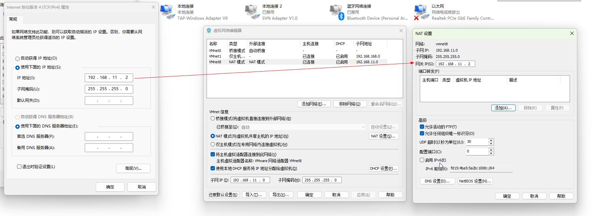

# 防火墙

```shell
#Ubuntu 如果使用的是 ufw（Ubuntu 默认防火墙），允许所有端口（入站+出站）一行命令
sudo ufw default allow incoming && sudo ufw default allow outgoing && sudo ufw allow from any && sudo ufw reload

```

# VMware NAT 网络配置



# pg 库

## 安装

### 1. 安装 PostgreSQL 及常用拓展

sudo apt update
sudo apt install -y postgresql postgresql-contrib

### 2. 启动并设置开机自启

sudo systemctl enable --now postgresql

### 3. 设置数据库密码 (将 'devpassword' 替换为你自己的密码)

sudo -u postgres psql -c "ALTER USER postgres WITH PASSWORD 'devpassword';"

sudo vim /etc/postgresql/16/main/postgresql.conf

找到 listen_addresses，取消注释并改为：listen_addresses = '*'

sudo vim /etc/postgresql/16/main/pg_hba.conf

在文件末尾追加一行：
host all all 0.0.0.0/0 scram-sha-256

重启pg
sudo systemctl restart postgresql

关闭自启
sudo systemctl disable postgresql && sudo systemctl daemon-reload

开启自启
sudo systemctl enable postgresql && sudo systemctl daemon-reload

### 本地连接

psql -U postgres -h 127.0.0.1 -p 5432

# ck库

## 安装

### 1. 运行官方一键安装脚本（会提示你输入默认账号 default 的密码，输入即可）

curl https://clickhouse.com | sh

### 2. 将 ClickHouse 安装为系统服务

sudo ./clickhouse install

### 3. 启动并设置开机自启

sudo systemctl enable --now clickhouse-server

### 开启远程连接

ClickHouse 默认也只监听本地 127.0.0.1。

打开配置文件：

Bash
sudo nano /etc/clickhouse-server/config.xml
找到 <listen_host>::</listen_host> 这一行，取消注释（或者添加一行 <listen_host>0.0.0.0</listen_host>）。

重启 ClickHouse：

sudo clickhouse restart

启动

sudo clickhouse start

本地测试连接：

clickhouse-client --user default

clickhouse-client -h 192.168.11.100 --port 9000 -u default --password

测试服务 curl "http://192.168.11.100:8123"
会返回：Ok.

### 安装服务设置开机自启

路径是标准的 /usr/bin/clickhouse。

直接复制并运行以下命令，一步到位完成开机自启配置：

1. 写入服务配置文件
   运行以下命令（自动写入 systemd 配置）：

```shell

sudo bash -c 'cat <<EOF > /etc/systemd/system/clickhouse-server.service
[Unit]
Description=ClickHouse Server (DBMS)
After=network-online.target
Wants=network-online.target

[Service]
Type=simple
User=root
Group=root
ExecStart=/usr/bin/clickhouse server --config-file=/etc/clickhouse-server/config.xml
Restart=always
RestartSec=3
LimitNOFILE=262144

[Install]
WantedBy=multi-user.target
EOF'

```

2. 加载配置并开启自启

#### 重新加载系统服务

sudo systemctl daemon-reload

#### 设置开机自启

sudo systemctl enable clickhouse-server

#### 启动服务

sudo systemctl start clickhouse-server

3. 验证结果
   执行：

sudo systemctl status clickhouse-server

只要看到绿色的 active (running)，且第一行显示 loaded (...; enabled; ...)，就说明开机自启已经彻底配置好了。

# 系统操作

## idea-U 创建快捷方式

```shell
# 在 Ubuntu 终端执行这一条，创建 idea-U 的桌面和应用列表快捷方式
sudo tee /home/diguapao/桌面/idea-community.desktop >/dev/null <<'EOF'
[Desktop Entry]
Type=Application
Name=IntelliJ IDEA Community 2025
Exec=/home/diguapao/下载/ideaIC-2025.2.6.3/idea-IC-252.28539.97/bin/idea.sh
Icon=/home/diguapao/下载/ideaIC-2025.2.6.3/idea-IC-252.28539.97/bin/idea.svg
Terminal=false
Categories=Development;IDE;
EOF
sudo chmod +x /home/diguapao/桌面/idea-community.desktop
sudo chown diguapao:diguapao /home/diguapao/桌面/idea-community.desktop
#然后在桌面上：
#1. 右键 IntelliJ IDEA Community 2025
#2. 点 允许启动 / Allow Launching
#如果想顺便加入应用菜单，用这一条：
mkdir -p ~/.local/share/applications && cp /home/diguapao/桌面/idea-community.desktop ~/.local/share/applications/

```