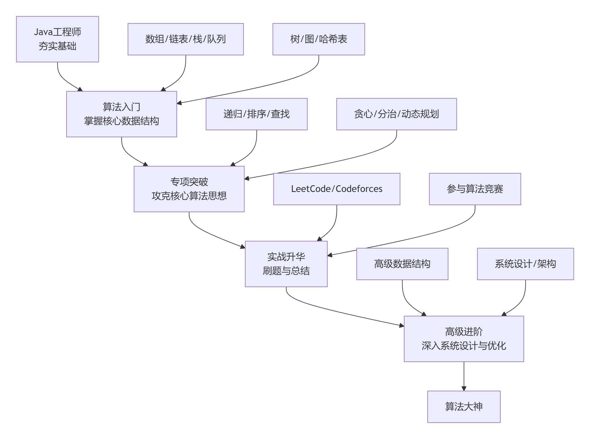

# 01-第一阶段：夯实基础
[README.md](./01-第一阶段：夯实基础/README.md)
# 02-第二阶段：专项突破与系统练习

# 03-第三阶段：高级进阶与视野拓展

# 04-心态与习惯

# 起心动念

我是一名Java开发工程师，我想成为算法大声。

因此，问了下AI，它是这么说的：

想从Java工程师成长为算法大神，这个目标非常棒。

这条路需要系统性地构建知识体系、大量动手实践和持续迭代思维。下面是一份为你量身定制的进阶路线图：

# 🔰 第一阶段：夯实基础

这个阶段的目标是让你像建筑师熟悉砖瓦水泥一样，掌握算法世界的“基本构件”。

精通核心数据结构：你必须非常熟悉它们的特点、适用场景和时间复杂度。这是所有复杂算法的基础。

吃透基础算法思想：

递归：理解递归的思想和代码实现，这是理解很多高级算法（如DFS、动态规划）的钥匙。

排序与查找：不仅要会用，更要理解其原理和复杂度。特别是快速排序、归并排序和二分查找，它们的思想会贯穿整个算法学习过程。

深入Java语言特性：利用你Java工程师的优势。深入理解Java的集合框架（如ArrayList、HashMap、TreeSet的实现原理）、JVM内存模型和多线程并发知识。这能帮助你在实现算法时，做出更高效、更安全的选择。

# 💪 第二阶段：专项突破与系统练习

有了一定基础后，就需要向更复杂的算法思想发起挑战，并通过系统练习将它们内化。

攻克核心算法思想：这是算法学习的重头戏，也是分水岭。

贪心算法：学会在每一步选择中都采取当前最优解，希望导致全局最优。

分治法：掌握“分而治之”的策略，将大问题分解为小问题，逐个击破后再合并结果（如归并排序）。

动态规划（DP）：这是重点和难点。学会将问题分解为重叠子问题，并存储子问题的解来避免重复计算。从经典的背包问题、最长公共子序列等问题入手。

图论算法：掌握图的深度优先搜索（DFS） 和广度优先搜索（BFS），以及最短路径算法（如Dijkstra） 和最小生成树算法等。

科学刷题，注重总结：开始在有名的在线评测平台（如LeetCode、Codeforces）上练习。

按标签/专题刷题：集中一段时间专门刷某一类题（如“动态规划”专题），有助于快速掌握这类问题的套路和变形。

一题多解与总结：一道题AC（通过）后，去讨论区看看别人的优秀解法。思考哪种解法时间/空间复杂度更优，总结解题的通用模式。准备一个笔记本来记录这些心得，这比盲目刷100道题更有效。

# 🚀 第三阶段：高级进阶与视野拓展

要成为“大神”，意味着你不仅要会解题，还要能设计高效、优雅的系统解决方案。

掌握高级数据结构与算法：学习并实践更复杂的数据结构和算法，如并查集、字典树、线段树、各种字符串匹配算法等。这些工具能让你在面对特定问题时，拥有更强大的武器库。

参与算法竞赛：尝试参加CSP认证、CCSP竞赛或ACM-ICPC等比赛。这些比赛极具挑战性，能极大锻炼你在压力下的快速思维、代码能力和团队协作能力。许多高手都认为这是快速提升的捷径。

关注系统设计与架构：算法大神的价值不仅在于解谜题，更在于解决复杂的系统性问题。学习设计模式、面向服务架构、微服务、分布式系统等知识。思考如何将高效的算法应用到大型系统中，解决实际的性能瓶颈和业务难题。

# 💡 心态与习惯

- 耐心与坚持：算法学习绝非一蹴而就，会遇到很多“想破头”的时刻。这是正常的，接受挫折是学习的一部分，重要的是保持耐心和持续练习。

- 刻意练习：不要停留在舒适区。主动去攻克那些让你感到有点困难的题目，并定期复习错题和经典解法。

- 融入社区：加入技术论坛、社群，多和志同道合的人交流。阅读高手们的解题思路和代码，参与讨论，能帮你打开新世界的大门。

- 理论与实践结合：在工作中寻找机会应用算法知识。比如，用更高效的查找替代线性搜索，用缓存策略优化性能。让算法为你解决实际问题，你会获得更大的成就感。

**这条路需要时间和努力，但每一步都算数。希望这份路线图能为你指明方向。如果在某个具体阶段遇到困惑，比如如何高效刷题，或者对某个算法概念不理解，随时可以再来问我，我们可以进行更深入的探讨。**